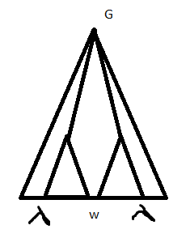

# Лингвистические основы информатики

***

> *12.02.2019* 

## Организационные вопросы

* Петрова Елена Александровна [elena.petrova@urfu.ru](mailto:elena.petrova@urfu.ru)

* Консультации: понедельник 16:10 КАДМ
## Рекомендуемая литература

  - [Языки, грамматики, распознаватели](http://kadm.imkn.urfu.ru/files/shurzam.pdf) (Шур, Замятин) - основной учебник (много багов!)
  - Ахо, Лам, Сети, Ульман "Компиляторы. Принципы, технологии, инструменты" (Dragon book)
  - Ахо, Ульман "Теория синтаксического анализа, перевода и компиляции"
  - Cooper K. Engineering a Compiler.

> [репозиторий с .djvu книгами](https://github.com/afrolovskiy/compilers_labs/tree/master/literature)

– Чем будем заниматься? – Теорий компиляции.
Узнаем:

- Что такое язык;

- Что такое компилятор;

- Что делает компилятор с языком;

Будем в теории знать, как написать компилятор.

Немножко комментарием и истории: 

>Даже разбор формулы в экселе использует какие-то приёмы компиляции! 
>
>В 50-х годах людям надоело писать на ассемблере, и они начали думать. 
>
>К 60-м придумали. Дейкстра - двигатель прогресса, потому что придумал теорию, а не какое-то специфичное для задачи решение.

## Что такое компилятор? 

По-простому – переводчик с языка на язык. Можно рассматривать как чёрный ящик с каким-то входом, выходом и магией внутри.

Принято разделять его работу на 2 фазы: 

***

&#8595; исходный текст

фронтенд: __анализ__ исходного текста. Если есть ошибки, то останавливаемся.

&#8595; промежуточное представление

бэкенд: __синтез__ – генерация программы, которая нам нужна вместе с какими-то оптимизациями.

&#8595; целевой код

***

Заниматься будем фронтендом!

**Блок анализа**

***

&#8595; исходный текст

лексический анализ: разбиваем текст на токены – знаки, переменные, идентификаторы.

&#8595; токены

синтаксический анализ(парсер)

&#8595; промежуточное представление 

***

## Язык 

1. Лексика ~ слова

2. Синтаксис - правила построение предложений

3. Семантика

__Таблица символов__ – информация о переменных, константах, функциях. Используется на всех шагах анализа.

_Заполнение_: 

- лексика(?): встречаем новый символ – записываем имя переменной и записываем место первого появления.

- семантика: тип, место хранения, время объявления.

Написанию компилятора предшествует описание языка.

_Рассмотрим язык с условным оператором_:

Что есть условный оператор с точки зрения синтаксиса?  Опишем это с помощью __форм Бэкуса–Нуара__:

```
<условный оператор>::== if <логическое выражение> <список операторов> | else <список операторов>

<список операторов>::== <оператор>|<оператор>;<список операторов>

...

<идентификатор>::== [a-zA-Z]\w*
```

> **Обозначения**
>
> | {} — альтернатива
>
> <> — синтаксическая категория
>
> ::== — выводимость

**[Порождающая] грамматика** - объект математический. Основной способ описания синтаксиса и лексики (частный случай синтаксиса).

_Опр:_ __Грамматика__ – $G =:<\Sigma, \Gamma, P, S>$, где

- $\Sigma$ – терминальный алфавит (выходной);

- $\Gamma$ – нетерминальный алфавит (вспомогательный);

- $P$ – множество правил вывода;

- $S \in \Gamma$ – выделенный нетерминал – аксиома (одна).

_**Соглашения**_

- $a, b, c, :…$ – терминальные состояния (if - терминал);
- $x, y, z, :…$ – цепочки (слова) терминалов;
- $A, B, C, :…$ – нетерминалы;
- $X, Y, Z, :…$ – что угодно;
- $\alpha, \beta, \gamma, :...$ – произвольные цепочки (терминальные или нетерминальные);
- $\lambda$ – пустое слово.

_**Выводимость**_ 

**Правило вывода:**  $(\alpha \rightarrow \beta)$ $\alpha;\beta \in (\Sigma \cup\Gamma)^*$, более конкретно $\alpha \in (\Sigma\cup\Gamma)^*\Gamma(\Sigma\cup\Gamma)^*$ - т.е в $\alpha$ должен быть хотя бы один элемент из не терминального состояния.

Основная функция этого правила – порождение языка.

_Опр:_ Цепочка $\gamma$ **непосредственно выводима** из цепочки $\sigma$, если $\gamma = \delta_1\beta \delta _2$, $\sigma = \delta _1 \alpha \delta _2$ и $(\alpha \rightarrow \beta) \in P$.

Обозначается как $\sigma \Rightarrow \gamma$.

> В цепочке сигма есть подпоследовательность альфа, которую можно заменить на бету. Выводимость - отношение на множестве цепочек. Рефлексивно-транзитивное замыкание $\sigma \Rightarrow \gamma.$ Возможность вывести одну цепочку из другой за некоторое число шагов.

_Опр:_ $\gamma$ **выводима** из $\sigma$ если существует последовательность цепочек $\eta_0, ..., \eta_n, n \ge 0$ такая, что $\eta _0 = \sigma, \eta _n = \gamma, \eta _{i-1} \Rightarrow \eta _i$ $ (\sigma \Rightarrow ^*\gamma)$.

Последовательность $\eta_0, ..., \eta_n$ – **вывод**.

Получается, что грамматика для нас — просто набор правил вывода. Потому что всё остальное мы зафиксировали в обозначениях.

_Опр:_ **Язык**, порождённый грамматикой $G = :<\Sigma, \Gamma, P, S>$ : ${w \in \Sigma^*|S \Rightarrow ^*w}$ — множество терминальных цепочек таких, что их можно вывести из аксиомы.

_Опр:_ $\eta_0, ..., \eta_n: \eta_0=s, \eta_n=w, \eta _{i-1} \Rightarrow \eta _i$, $\eta_i$ – форма (шаг).

_**Пример**_:

${a^n b^n | n \in \N_0}$ — Что это? Язык?

_Правила:_

- $S \rightarrow aSb$
- $S \rightarrow \lambda$

Рассмотрим вывод терминальной цепочки:

$S \Rightarrow aSb \Rightarrow aaSbb \Rightarrow aabb$

> $ab$ - терминалы (см. соглашения)

_**Ещё пример**_

$S \rightarrow ABS|\lambda$	$S \rightarrow SS|a|b|\lambda$

$AB \rightarrow BA​$

$A \rightarrow a​$

$B \rightarrow b$

$S \Rightarrow ABS \Rightarrow ABABS \Rightarrow ^* (AB)^nS \Rightarrow (AB)^n$

Можем перейти к терминалам

$S \Rightarrow ^*ABABAB \Rightarrow ABBAAB \Rightarrow abbaab$

Хотим загнать буквы А в конец, а B в начало. Будем менять местами буквы по второму правилу.

$ABABAB \Rightarrow BA_AB_AB \Rightarrow B_AB_AAB \Rightarrow BBAA_AB_ \Rightarrow :...$

# 

> *19.02.2019*

```
pos = init + rate * 60;

// после лескического анализа превращается в...
id,15 <=> <id,2><+><id,3><*><const><;>
// cинтаксическому анализу всё равно, как называется переменная

// после ситанксического анализа превращается в...
    =
   / \
id,1   +
      / \
   id,2  *
        / \
     id,3 const
//после семантического добавятся какие-то атрибуты
```

На каждой стадии – новый язык. Значит, нужны новые способы порождения\описания. А этот способ порождает распознаватель.

## Иерархия Хомского-Шютценберже

|      | Вид грамматики           | Распознаватель                                         | Класс языков            |
| ---- | ------------------------ | ------------------------------------------------------ | ----------------------- |
| 0    | Грамматика обычного вида | МТ                                                     | Рекурсивно перечислимые |
| 1    | Контекстно-зависимые     | МТ с линейно ограниченной памятью (LBA)                | КЗЯ                     |
| 2    | Контекстно-свободные     | Недетерминированный автомат с магазинной памятью (PDA) | КСЯ                     |
| 3    | Праволинейные            | ДКА                                                    | Регулярные языки        |

Опр. Контекстно-зависимая грамматика — все правила имеют вид $\alpha A\gamma \rightarrow \alpha \beta\gamma$ (у терминала имеется контекст, который сохраняется при его раскрытии) .

Опр. Язык обладает свойством $P$, если $\exists$ грамматика со свойством $P$, его порождающая.

Опр. Контекстно-свободная грамматика — все правила имеют вид $A \rightarrow \beta$ (частный случай КЗГ, когда оба контекста пусты)

Опр. Праволинейные грамматики — все правила имеют вид $A \rightarrow aB$ или $A \rightarrow\lambda $ справа либо лямбда, либо терминал+нетерминал

Вспомним пример. Кажется, что это грамматика обычного вида.

$S \rightarrow ABS|\lambda$	$S \rightarrow SS|a|b|\lambda$

$AB \rightarrow BA$

$A \rightarrow a$

$B \rightarrow b$

Построим КСГ, которая породит язык выше. Порождаем цепочки, где букв B на одну больше, чем a/

Из А должны выводиться строчки, где на одну a больше

$S \rightarrow aB|bA$

$A \rightarrow aS|bAA$

$B\rightarrow bS|aBB$

$A \rightarrow a$

$B \rightarrow b$

$abba : :S \rightarrow aB \rightarrow abS \rightarrow abbA \rightarrow abba $

Иерархия: регулярные $\subset$ КСЯ $\subset$ КЗЯ $\subset$ Rec $\subset$ RecEn[^2].

## Контекстно-свободные грамматики и языки

Опр. Упорядоченное дерево — дерево с заданным линейным порядком со следующими свойствами:

1. Если $x$ - сын узла $y$, то $x \ge y$
2. Если $x \le y$ и они братья, то для всех сыновей $z$ узла $x$: $z\le y$

> Порядок, возникающий при обходе в глубину слева направо

**Пример**:

$S \rightarrow SS|(s)|\lambda$

$(( ))$

$S \rightarrow SS \rightarrow (s) \rightarrow ((s)) \rightarrow (())$

```
           S₁
         /   \
        S₂    S₄
	    |	 / | \
        λ₃ (₅  s₆  )₁₁
             / | \
          (₇   s₈  )₁₀
               |
               λ₉
```

Опр. Дерево вывода цепочки $\omega$ в $G =:<\Sigma, \Gamma, P, S>$ — упорядоченное дерево со следующими свойствами:

1. Узлы – нетерминалы, корень – аксиома, листья – терминалы или $\lambda$, причём у листьев, помеченных пустым словом нет братьев.

   > Если есть братья, то $\lambda a == a$

2. Если у узла $x$ все сыновья это некоторый набор $y_1, : … : y_n$, таких, что $y_1 \le : ...: \le y_n$, и узлы $x$, $y_1, : … : y_n$ помечены символами $X, Y_1, : … : Y_n$, то $(X \rightarrow Y_1, : … : Y_n) \in P$.

   > Применили правило, в дереве появился куст вывода

3. Если все листья дерева имеют метки $a_1 \le a_2 \le : … \le : a_n$, то $\omega = a_1…a_n$

Опр. Вывод цепочки $\omega (S \Rightarrow \alpha_1 \Rightarrow : … : \Rightarrow \alpha_n=\omega)​$ в $G =:<\Sigma, \Gamma, P, S>​$ представлен деревом вывода $T​$, если $\exists​$ набор стандартных поддеревьев $T_1, … T_n​$ таких, что на упорядоченных листьях дерева $T_i ​$ написана форма $\alpha_i​$.

Опр. Стандартное поддерево $T' $дерева $T$, если:

1. корень $T'$ - корень $T$

2. Если узел $x$ дерева $T$$ \in T'$, то либо $x$ - лист, либо все сыновья $x$ в $T$ $\in T'$

   > Если с узлом лежит хотя бы один его сын, то и все его сыновья тоже лежат.

**Пример по последнему языку:**

[Стандартные поддеревья](https://github.com/Ollisteka/lectures/raw/master/loi/.%5Cimages%5Cstandard_subtrees.jpg) [и тут](https://github.com/Ollisteka/lectures/blob/master/loi/.%5Cimages%5Cstandard_subtrees.jpg)

Наша любимая грамматика, которая порождает арифметику:

$E \rightarrow E+E|E*E|(E)|x​$

$x+x*x$

```
   E
  /|\
E  +  E   - этот куст можно передвинуть влево, получится два разных дерева
|    /|\    для одного и того же. Плохо.
x   E * E
    |   |
    x   x
```

Опр. Грамматика однозначна, если $\forall \omega$, выводимой в грамматике, $\exists!$ дерево вывода.

Следующая грамматика однозначна и эквивалентна предыдущей

$E \rightarrow E + T|T$

$T \rightarrow T*F|F$

$F \rightarrow (E) |x$

1. Правосторонний вывод и r-формы:$E \rightarrow E + T \rightarrow E+T*F \rightarrow E+T*x \rightarrow E+F*x \rightarrow E+x*x\rightarrow T+x*x \rightarrow F+x*x \rightarrow x+x*x$
2. Левосторонний вывод и l-формы:$E \rightarrow E+T\rightarrow T+T \rightarrow F+T \rightarrow x+T \rightarrow x+T*F \rightarrow x+F*F \rightarrow x+x*F\rightarrow x+x*x $

Плата за однозначность - увеличение длины вывода

> 26.02.2019 

## Праволинейная грамматика
| A $\rightarrow \alpha B$ | A $\rightarrow \alpha B$ |
| ------------------------ | :----------------------- |
| A $\rightarrow \lambda$  | A $\rightarrow$ a        |

_**Теорема**_

Праволинейная грамматика порождает регулярный язык

_Д-во:_

​	$G = (\Sigma, \Gamma, P, S)​$

​	$KA = (\Sigma, \Gamma, \delta, S, F)$

​	$F = {A \in \Gamma | (A \rightarrow \lambda) \in P}$

​	$\delta(A, a) = B <=> (A \rightarrow aB) \in P$

​	A <-a-> B

​	$w = a_1... a_n$

​	$S \rightarrow a_1A_1 \rightarrow a_1a_2A_2 \rightarrow  ...\rightarrow a_1...a_nA_, \rightarrow a_1...a_n$

_Строим автомат по рег. выр-ю_

a(b+cc)*

<svg width="400" height="150" version="1.1" xmlns="http://www.w3.org/2000/svg">
	<ellipse stroke="black" stroke-width="1" fill="none" cx="118.5" cy="88.5" rx="30" ry="30"/>
	<text x="112.5" y="94.5" font-family="Times New Roman" font-size="20">S</text>
	<ellipse stroke="black" stroke-width="1" fill="none" cx="223.5" cy="100.5" rx="30" ry="30"/>
	<text x="216.5" y="106.5" font-family="Times New Roman" font-size="20">A</text>
	<ellipse stroke="black" stroke-width="1" fill="none" cx="337.5" cy="88.5" rx="30" ry="30"/>
	<text x="330.5" y="94.5" font-family="Times New Roman" font-size="20">B</text>
	<path stroke="black" stroke-width="1" fill="none" d="M 213.439,72.362 A 22.5,22.5 0 1 1 239.714,75.398"/>
	<text x="228.5" y="23.5" font-family="Times New Roman" font-size="20">b</text>
	<polygon fill="black" stroke-width="1" points="239.714,75.398 248.809,72.893 241.448,66.125"/>
	<polygon stroke="black" stroke-width="1" points="148.306,91.906 193.694,97.094"/>
	<polygon fill="black" stroke-width="1" points="193.694,97.094 186.313,91.218 185.178,101.153"/>
	<text x="164.5" y="116.5" font-family="Times New Roman" font-size="20">a</text>
	<polygon stroke="black" stroke-width="1" points="253.335,97.359 307.665,91.641"/>
	<polygon fill="black" stroke-width="1" points="307.665,91.641 299.185,87.505 300.232,97.451"/>
	<text x="278.5" y="116.5" font-family="Times New Roman" font-size="20">c</text>
	<polygon stroke="black" stroke-width="1" points="307.665,91.641 253.335,97.359"/>
	<polygon fill="black" stroke-width="1" points="253.335,97.359 261.815,101.495 260.768,91.549"/>
	<text x="274.5" y="84.5" font-family="Times New Roman" font-size="20">c</text>
</svg>

$S \rightarrow aA​$

$A \rightarrow bA|cB|\lambda​$

$B \rightarrow cA$

### Преобразования грамматик 

Грамматики эквивалентные, если они порождают один и тот же язык.

#### Приведенные грамматики

_Опр:_ Нетерминал A $\in \Gamma$ - производящий, если из него можно получить производящую цепочку $A \Rightarrow _G^* u^- $

_Опр:_ A $\in \Gamma$ - достижимый, если  $A \Rightarrow _G^* \alpha A\beta $

_Опр:_ Грамматика приведенная, если все ее нетерминалы достижимые и производящие

***Примеры***

$S \rightarrow bAc | AcB​$

$A \rightarrow abC​$

$B \rightarrow Ea​$

$C \rightarrow BD​$

$D \rightarrow CCa​$

$E \rightarrow Fbb$

$F \rightarrow a$

$\Gamma_p$ = {F, E, B} - производящие 

$\Gamma_r$ = {S, A, B, C, E, D, F} - достижимые

Нахождение $\Gamma_r: \Gamma_r \rightarrow S​$ -> ~~S~~, A, B -> ~~S~~, ~~A~~, B, C, E -> ~~S~~, ~~A~~, ~~B~~, C, E, D -> ~~S~~, ~~A~~, ~~B~~, ~~C~~, E, D, F

$\Gamma_r^n = \Gamma_r^{n-1} \cup \{A | (B \rightarrow \alpha A\beta) \in P, B \in \Gamma_r^{n-1}\}$

добавляем нетерминалы из правой части

$\Gamma_p: $ все нетерминалы, из которых вывод цепочки за 1 шаг

$\Gamma_p^{n} = \Gamma_p{n-1} \cup \{A | (A \rightarrow \gamma) \in P, \gamma \in (\Sigma \cup \Gamma_p^{n-1})\}​$

**Теорема**
Для любой КСГ G существует эквивалентная ей приведенная грамматика
_Д-во:_ 
	КСГ G = ($\Sigma, \Gamma, P, S$)
	Находим $\Gamma_p$
	Если S $\notin \Gamma_p, то G' = (\Sigma, \emptyset, \emptyset, \emptyset)$
	Иначе $\widetilde{G} = (\Sigma, \Gamma_p, \widetilde{P}, S)$
	$\widetilde{P} = \{(A \rightarrow \gamma) \in P |A,\gamma \in (\Sigma \cup \Gamma_p)^*\}$

​	Находим $(\Gamma_p)_r$

​	$G' = (\Sigma, (\Gamma_p)_r, P', S)$

​	P' = {$(A \rightarrow \gamma) \in \widetilde{P}| A, \gamma \in (\Sigma \cup (\Gamma_p)|r)^*$}

​	$(\Gamma_p)_p - достижимы\ в\ \widetilde{G}, G', производящие\ в\ \widetilde{G}, G'$

​	$A \in (\Gamma_p)_r​$

​	$S {\Rightarrow}_{\widetilde{G}}^* \lambda AB \Rightarrow_{\widetilde{G'}}^* uwv ​$

**_Пример_**

S $\rightarrow$ ab|bAC

A $\rightarrow$ CB

B $\rightarrow$ aSA

C $\rightarrow​$ bC|d

1) производящие $\rightarrow$ достижимые 

​	$\Gamma_p = \{C, S\}; (\Gamma_p)_r = \{S\}; [G': S \rightarrow ab]$

2) достижимые $\rightarrow$ производящие

​	$\Gamma_p = \{S, A, B, C\}; (\Gamma_p)_r = \{C, S\}; [G': S \rightarrow ab; C \rightarrow d ]​$

#### $\lambda$ - свободные грамматики 

_Опр:_ $A \in \Gamma - аннулируем, если A => ^* \lambda$

Ann(G) - мн-во анн нетерм.

Нахождение аннулирующий символов

$Ann^1(G) = \{A \in \Gamma | (A \rightarrow \lambda) \in P\}$

$Ann^n(G) = Ann^{n-1}(G) \cup \{A \in \Gamma | (A \rightarrow \gamma ) \in P, \gamma \in (Ann^{n-1}(G))^*\}​$

Пример

S $\rightarrow$ aBC|AE

A $\rightarrow$ bC| $\lambda$

B $\rightarrow$ ACA

C $\rightarrow \lambda$

E $\rightarrow$ CA

D $\rightarrow$ bE|c

Ann(G):

1. {A,C}
2. {A,C, B, E}
3. {A, B, C, E, S}

_Опр:_ $\lambda​$ - свободная грамматика - грамматика, которая либо не содержит аннулирующих правил вида $(A \rightarrow \lambda)​$, либо содержит единств. такое правило S $\rightarrow \lambda​$ и S не встреч-ся в правых частях правил вывода.

__Теорема__ Любая грамматика эквивалентна некоторой $\lambda$ -свободной грамматике 

_Д-во:_

​	$G = (\Sigma, \Gamma, P, S) - исх., G' = (\Sigma, \Gamma', P', S') - \lambda\ свободная $

0. Если $\lambda \in L(G), то  \Gamma' = \Gamma \cup S', P' = P \cup \{(S' \rightarrow \lambda), (S' \rightarrow S)\}$

​	Иначе $\Gamma = \Gamma'$, S = S', P = P'

1. Построить Ann(G)

   1.5 в \Gamma' = \{A | (A \rightarrow \gamma) \in P, \gamma \neq \lambda\}

2. $\beta \preccurlyeq \gamma​$, если $\beta​$ - подпосл-ть $\gamma​$ и все символы $\gamma​$, которых нет в $\beta​$, аннулирующие.

   P' = $\{(A \rightarrow \beta) | (A \rightarrow \gamma) \in P, \beta \preccurlyeq \gamma, \beta \neq \lambda\}$

L(G) = L(G')
1. w $\in$ L(G)
    $S => \alpha_1 => ... => \alpha_{11} = w.$
    $\alpha_i => \alpha_{i+1}(A \rightarrow \beta) \in P'$
    			$\Downarrow​$

  $в G\ \exists(A \rightarrow \gamma) \in P, \beta \preccurlyeq \gamma, причем\ \gamma => ^* \beta $

2. w = L(G)	

_Пример_

Отрезаем поддеревья с $\lambda$ на конце. Предок этого поддерева имеет сыновей с непустыми на конце цепочками.

 

**_Пример_**
 $S \rightarrow ~~abc~~|aB|~~aC~~|a|A|E|AE$

 $S' \rightarrow S|\lambda$

$A \rightarrow \cancel{bc}|b; B \rightarrow \cancel{ACA}|\cancel{AC}|AA|\cancel{CA}|A|\cancel{C}$

$E \rightarrow A; D \rightarrow bE|b|c$


