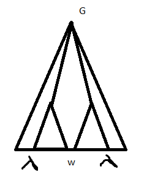

# Лингвистические основы информатики

***

> *12.02.2019* 

## Организационные вопросы

* Петрова Елена Александровна [elena.petrova@urfu.ru](mailto:elena.petrova@urfu.ru)

* Консультации: понедельник 16:10 КАДМ
## Рекомендуемая литература

  - [Языки, грамматики, распознаватели](http://kadm.imkn.urfu.ru/files/shurzam.pdf) (Шур, Замятин) - основной учебник (много багов!)
  - Ахо, Лам, Сети, Ульман "Компиляторы. Принципы, технологии, инструменты" (Dragon book)
  - Ахо, Ульман "Теория синтаксического анализа, перевода и компиляции"
  - Cooper K. Engineering a Compiler.

> [репозиторий с .djvu книгами](https://github.com/afrolovskiy/compilers_labs/tree/master/literature)

– Чем будем заниматься? – Теорий компиляции.
Узнаем:

- Что такое язык;

- Что такое компилятор;

- Что делает компилятор с языком;

Будем в теории знать, как написать компилятор.

Немножко комментарием и истории: 

>Даже разбор формулы в экселе использует какие-то приёмы компиляции! 
>
>В 50-х годах людям надоело писать на ассемблере, и они начали думать. 
>
>К 60-м придумали. Дейкстра - двигатель прогресса, потому что придумал теорию, а не какое-то специфичное для задачи решение.

## Что такое компилятор? 

По-простому – переводчик с языка на язык. Можно рассматривать как чёрный ящик с каким-то входом, выходом и магией внутри.

Принято разделять его работу на 2 фазы: 

***

&#8595; исходный текст

фронтенд: __анализ__ исходного текста. Если есть ошибки, то останавливаемся.

&#8595; промежуточное представление

бэкенд: __синтез__ – генерация программы, которая нам нужна вместе с какими-то оптимизациями.

&#8595; целевой код

***

Заниматься будем фронтендом!

**Блок анализа**

***

&#8595; исходный текст

лексический анализ: разбиваем текст на токены – знаки, переменные, идентификаторы.

&#8595; токены

синтаксический анализ(парсер)

&#8595; промежуточное представление 

***

## Язык 

1. Лексика ~ слова

2. Синтаксис - правила построение предложений

3. Семантика

__Таблица символов__ – информация о переменных, константах, функциях. Используется на всех шагах анализа.

_Заполнение_: 

- лексика(?): встречаем новый символ – записываем имя переменной и записываем место первого появления.

- семантика: тип, место хранения, время объявления.

Написанию компилятора предшествует описание языка.

_Рассмотрим язык с условным оператором_:

Что есть условный оператор с точки зрения синтаксиса?  Опишем это с помощью __форм Бэкуса–Нуара__:

```
<условный оператор>::== if <логическое выражение> <список операторов> | else <список операторов>

<список операторов>::== <оператор>|<оператор>;<список операторов>

...

<идентификатор>::== [a-zA-Z]\w*
```

> **Обозначения**
>
> | {} — альтернатива
>
> <> — синтаксическая категория
>
> ::== — выводимость

**[Порождающая] грамматика** - объект математический. Основной способ описания синтаксиса и лексики (частный случай синтаксиса).

_Опр:_ __Грамматика__ – $G =:<\Sigma, \Gamma, P, S>$, где

- $\Sigma$ – терминальный алфавит (выходной);

- $\Gamma$ – нетерминальный алфавит (вспомогательный);

- $P$ – множество правил вывода;

- $S \in \Gamma$ – выделенный нетерминал – аксиома (одна).

_**Соглашения**_

- $a, b, c, :…$ – терминальные состояния (if - терминал);
- $x, y, z, :…$ – цепочки (слова) терминалов;
- $A, B, C, :…$ – нетерминалы;
- $X, Y, Z, :…$ – что угодно;
- $\alpha, \beta, \gamma, :...$ – произвольные цепочки (терминальные или нетерминальные);
- $\lambda$ – пустое слово.

_**Выводимость**_ 

**Правило вывода:**  $(\alpha \rightarrow \beta)$ $\alpha;\beta \in (\Sigma \cup\Gamma)^*$, более конкретно $\alpha \in (\Sigma\cup\Gamma)^*\Gamma(\Sigma\cup\Gamma)^*$ - т.е в $\alpha$ должен быть хотя бы один элемент из не терминального состояния.

Основная функция этого правила – порождение языка.

_Опр:_ Цепочка $\gamma$ **непосредственно выводима** из цепочки $\sigma$, если $\gamma = \delta_1\beta \delta _2$, $\sigma = \delta _1 \alpha \delta _2$ и $(\alpha \rightarrow \beta) \in P$.

Обозначается как $\sigma \Rightarrow \gamma$.

> В цепочке сигма есть подпоследовательность альфа, которую можно заменить на бету. Выводимость - отношение на множестве цепочек. Рефлексивно-транзитивное замыкание $\sigma \Rightarrow \gamma.$ Возможность вывести одну цепочку из другой за некоторое число шагов.

_Опр:_ $\gamma$ **выводима** из $\sigma$ если существует последовательность цепочек $\eta_0, ..., \eta_n, n \ge 0$ такая, что $\eta _0 = \sigma, \eta _n = \gamma, \eta _{i-1} \Rightarrow \eta _i$ $ (\sigma \Rightarrow ^*\gamma)$.

Последовательность $\eta_0, ..., \eta_n$ – **вывод**.

Получается, что грамматика для нас — просто набор правил вывода. Потому что всё остальное мы зафиксировали в обозначениях.

_Опр:_ **Язык**, порождённый грамматикой $G = :<\Sigma, \Gamma, P, S>$ : ${w \in \Sigma^*|S \Rightarrow ^*w}$ — множество терминальных цепочек таких, что их можно вывести из аксиомы.

_Опр:_ $\eta_0, ..., \eta_n: \eta_0=s, \eta_n=w, \eta _{i-1} \Rightarrow \eta _i$, $\eta_i$ – форма (шаг).

_**Пример**_:

${a^n b^n | n \in \N_0}$ — Что это? Язык?

_Правила:_

- $S \rightarrow aSb$
- $S \rightarrow \lambda$

Рассмотрим вывод терминальной цепочки:

$S \Rightarrow aSb \Rightarrow aaSbb \Rightarrow aabb$

> $ab$ - терминалы (см. соглашения)

_**Ещё пример**_

$S \rightarrow ABS|\lambda$	$S \rightarrow SS|a|b|\lambda$

$AB \rightarrow BA​$

$A \rightarrow a​$

$B \rightarrow b$

$S \Rightarrow ABS \Rightarrow ABABS \Rightarrow ^* (AB)^nS \Rightarrow (AB)^n$

Можем перейти к терминалам

$S \Rightarrow ^*ABABAB \Rightarrow ABBAAB \Rightarrow abbaab$

Хотим загнать буквы А в конец, а B в начало. Будем менять местами буквы по второму правилу.

$ABABAB \Rightarrow BAABAB \Rightarrow BABAAB \Rightarrow BBAAAB \Rightarrow :...$

# 

> *19.02.2019*

```
pos = init + rate * 60;

// после лескического анализа превращается в...
id,15 <=> <id,2><+><id,3><*><const><;>
// cинтаксическому анализу всё равно, как называется переменная

// после ситанксического анализа превращается в...
    =
   / \
id,1   +
      / \
   id,2  *
        / \
     id,3 const
//после семантического добавятся какие-то атрибуты
```

На каждой стадии – новый язык. Значит, нужны новые способы порождения\описания. А этот способ порождает распознаватель.

## Иерархия Хомского-Шютценберже

|      | Вид грамматики         | Распознаватель                                         | Класс языков            |
| ---- | ---------------------- | ------------------------------------------------------ | ----------------------- |
| 0    | Грамматика общего вида | МТ                                                     | Рекурсивно перечислимые |
| 1    | Контекстно-зависимые   | МТ с линейно ограниченной памятью (LBA)                | КЗЯ                     |
| 2    | Контекстно-свободные   | Недетерминированный автомат с магазинной памятью (PDA) | КСЯ                     |
| 3    | Праволинейные          | ДКА                                                    | Регулярные языки        |

Опр. Контекстно-зависимая грамматика — все правила имеют вид $\alpha A\gamma \rightarrow \alpha \beta\gamma​$ (у терминала имеется контекст, который сохраняется при его раскрытии) .

Опр. Язык обладает свойством $P$, если $\exists$ грамматика со свойством $P$, его порождающая.

Опр. Контекстно-свободная грамматика — все правила имеют вид $A \rightarrow \beta$ (частный случай КЗГ, когда оба контекста пусты)

Опр. Праволинейные грамматики — все правила имеют вид $A \rightarrow aB$ или $A \rightarrow\lambda $ справа либо лямбда, либо терминал+нетерминал

Вспомним пример. Кажется, что это грамматика обычного вида.

$S \rightarrow ABS|\lambda$	$S \rightarrow SS|a|b|\lambda$

$AB \rightarrow BA$

$A \rightarrow a$

$B \rightarrow b$

Построим КСГ, которая породит язык выше. Порождаем цепочки, где букв B на одну больше, чем a/

Из А должны выводиться строчки, где на одну a больше

$S \rightarrow aB|bA$

$A \rightarrow aS|bAA$

$B\rightarrow bS|aBB​$

$A \rightarrow a​$

$B \rightarrow b$

$abba : :S \rightarrow aB \rightarrow abS \rightarrow abbA \rightarrow abba $

Иерархия: регулярные $\subset$ КСЯ $\subset$ КЗЯ $\subset$ Rec $\subset$ RecEn[^2].

## Контекстно-свободные грамматики и языки

Опр. Упорядоченное дерево — дерево с заданным линейным порядком со следующими свойствами:

1. Если $x$ - сын узла $y$, то $x \ge y$
2. Если $x \le y$ и они братья, то для всех сыновей $z$ узла $x$: $z\le y$

> Порядок, возникающий при обходе в глубину слева направо

**Пример**:

$S \rightarrow SS|(s)|\lambda$

$(( ))$ 

$S \rightarrow SS \rightarrow (s) \rightarrow ((s)) \rightarrow (())$

```
           S₁
         /   \
        S₂    S₄
	    |	 / | \
        λ₃ (₅  s₆  )₁₁
             / | \
          (₇   s₈  )₁₀
               |
               λ₉
```

Опр. Дерево вывода цепочки $\omega$ в $G =:<\Sigma, \Gamma, P, S>$ — упорядоченное дерево со следующими свойствами:

1. Узлы – нетерминалы, корень – аксиома, листья – терминалы или $\lambda$, причём у листьев, помеченных пустым словом нет братьев.

   > Если есть братья, то $\lambda a == a$

2. Если у узла $x$ все сыновья это некоторый набор $y_1, : … : y_n$, таких, что $y_1 \le : ...: \le y_n$, и узлы $x$, $y_1, : … : y_n$ помечены символами $X, Y_1, : … : Y_n$, то $(X \rightarrow Y_1, : … : Y_n) \in P$.

   > Применили правило, в дереве появился куст вывода

3. Если все листья дерева имеют метки $a_1 \le a_2 \le : … \le : a_n$, то $\omega = a_1…a_n$

Опр. Вывод цепочки $\omega (S \Rightarrow \alpha_1 \Rightarrow : … : \Rightarrow \alpha_n=\omega)​$ в $G =:<\Sigma, \Gamma, P, S>​$ представлен деревом вывода $T​$, если $\exists​$ набор стандартных поддеревьев $T_1, … T_n​$ таких, что на упорядоченных листьях дерева $T_i ​$ написана форма $\alpha_i​$.

Опр. Стандартное поддерево $T' $дерева $T$, если:

1. корень $T'$ - корень $T$

2. Если узел $x$ дерева $T$$ \in T'$, то либо $x$ - лист, либо все сыновья $x$ в $T$ $\in T'$

   > Если с узлом лежит хотя бы один его сын, то и все его сыновья тоже лежат.

**Пример по последнему языку:**

[Стандартные поддеревья](https://github.com/Ollisteka/lectures/raw/master/loi/.%5Cimages%5Cstandard_subtrees.jpg) [и тут](https://github.com/Ollisteka/lectures/blob/master/loi/.%5Cimages%5Cstandard_subtrees.jpg)

Наша любимая грамматика, которая порождает арифметику:

$E \rightarrow E+E|E*E|(E)|x​$

$x+x*x$

```
   E
  /|\
E  +  E   - этот куст можно передвинуть влево, получится два разных дерева
|    /|\    для одного и того же. Плохо.
x   E * E
    |   |
    x   x
```

Опр. Грамматика однозначна, если $\forall \omega$, выводимой в грамматике, $\exists!$ дерево вывода.

Следующая грамматика однозначна и эквивалентна предыдущей

$E \rightarrow E + T|T$

$T \rightarrow T*F|F$

$F \rightarrow (E) |x$

1. Правосторонний вывод и r-формы:$E \rightarrow E + T \rightarrow E+T*F \rightarrow E+T*x \rightarrow E+F*x \rightarrow E+x*x\rightarrow T+x*x \rightarrow F+x*x \rightarrow x+x*x$
2. Левосторонний вывод и l-формы:$E \rightarrow E+T\rightarrow T+T \rightarrow F+T \rightarrow x+T \rightarrow x+T*F \rightarrow x+F*F \rightarrow x+x*F\rightarrow x+x*x $

Плата за однозначность - увеличение длины вывода

> 26.02.2019 

## Праволинейная грамматика
| A $\rightarrow \alpha B$ | A $\rightarrow \alpha B$ |
| ------------------------ | :----------------------- |
| A $\rightarrow \lambda$  | A $\rightarrow$ a        |

_**Теорема**_

Праволинейная грамматика порождает регулярный язык

_Д-во:_

​	$G = (\Sigma, \Gamma, P, S)​$

​	$KA = (\Sigma, \Gamma, \delta, S, F)$

​	$F = {A \in \Gamma | (A \rightarrow \lambda) \in P}$

​	$\delta(A, a) = B <=> (A \rightarrow aB) \in P$

​	A <-a-> B

​	$w = a_1... a_n$

​	$S \rightarrow a_1A_1 \rightarrow a_1a_2A_2 \rightarrow  ...\rightarrow a_1...a_nA_, \rightarrow a_1...a_n$

_Строим автомат по рег. выр-ю_

a(b+cc)*

<svg width="400" height="150" version="1.1" xmlns="http://www.w3.org/2000/svg">
	<ellipse stroke="black" stroke-width="1" fill="none" cx="118.5" cy="88.5" rx="30" ry="30"/>
	<text x="112.5" y="94.5" font-family="Times New Roman" font-size="20">S</text>
	<ellipse stroke="black" stroke-width="1" fill="none" cx="223.5" cy="100.5" rx="30" ry="30"/>
	<text x="216.5" y="106.5" font-family="Times New Roman" font-size="20">A</text>
	<ellipse stroke="black" stroke-width="1" fill="none" cx="337.5" cy="88.5" rx="30" ry="30"/>
	<text x="330.5" y="94.5" font-family="Times New Roman" font-size="20">B</text>
	<path stroke="black" stroke-width="1" fill="none" d="M 213.439,72.362 A 22.5,22.5 0 1 1 239.714,75.398"/>
	<text x="228.5" y="23.5" font-family="Times New Roman" font-size="20">b</text>
	<polygon fill="black" stroke-width="1" points="239.714,75.398 248.809,72.893 241.448,66.125"/>
	<polygon stroke="black" stroke-width="1" points="148.306,91.906 193.694,97.094"/>
	<polygon fill="black" stroke-width="1" points="193.694,97.094 186.313,91.218 185.178,101.153"/>
	<text x="164.5" y="116.5" font-family="Times New Roman" font-size="20">a</text>
	<polygon stroke="black" stroke-width="1" points="253.335,97.359 307.665,91.641"/>
	<polygon fill="black" stroke-width="1" points="307.665,91.641 299.185,87.505 300.232,97.451"/>
	<text x="278.5" y="116.5" font-family="Times New Roman" font-size="20">c</text>
	<polygon stroke="black" stroke-width="1" points="307.665,91.641 253.335,97.359"/>
	<polygon fill="black" stroke-width="1" points="253.335,97.359 261.815,101.495 260.768,91.549"/>
	<text x="274.5" y="84.5" font-family="Times New Roman" font-size="20">c</text>
</svg>

$S \rightarrow aA​$

$A \rightarrow bA|cB|\lambda​$

$B \rightarrow cA$

### Преобразования грамматик 

Грамматики эквивалентные, если они порождают один и тот же язык.

#### Приведенные грамматики

_Опр:_ Нетерминал A $\in \Gamma$ - производящий, если из него можно получить производящую цепочку $A \Rightarrow _G^* u^- $

_Опр:_ A $\in \Gamma$ - достижимый, если  $A \Rightarrow _G^* \alpha A\beta $

_Опр:_ Грамматика приведенная, если все ее нетерминалы достижимые и производящие

***Примеры***

$S \rightarrow bAc | AcB​$

$A \rightarrow abC​$

$B \rightarrow Ea​$

$C \rightarrow BD​$

$D \rightarrow CCa​$

$E \rightarrow Fbb$

$F \rightarrow a$

$\Gamma_p$ = {F, E, B} - производящие 

$\Gamma_r​$ = {S, A, B, C, E, D, F} - достижимые

Нахождение $\Gamma_r: \Gamma_r \rightarrow S​$ -> ~~S~~, A, B -> ~~S~~, ~~A~~, B, C, E -> ~~S~~, ~~A~~, ~~B~~, C, E, D -> ~~S~~, ~~A~~, ~~B~~, ~~C~~, E, D, F

$\Gamma_r^n = \Gamma_r^{n-1} \cup \{A | (B \rightarrow \alpha A\beta) \in P, B \in \Gamma_r^{n-1}\}​$ - n-й шаг

добавляем нетерминалы из правой части

$\Gamma_p: ​$ все нетерминалы, из которых вывод цепочки за 1 шаг

$\Gamma_p^{n} = \Gamma_p^{n-1} \cup \{A | (A \rightarrow \gamma) \in P, \gamma \in (\Sigma \cup \Gamma_p^{n-1})\}$

**Теорема**
Для любой КСГ G существует эквивалентная ей приведенная грамматика
_Д-во:_ 
	КСГ G = ($\Sigma, \Gamma, P, S$)
	Находим $\Gamma_p$
	Если S $\notin \Gamma_p, то G' = (\Sigma, \emptyset, \emptyset, \emptyset)$
	Иначе $\widetilde{G} = (\Sigma, \Gamma_p, \widetilde{P}, S)$
	$\widetilde{P} = \{(A \rightarrow \gamma) \in P |A,\gamma \in (\Sigma \cup \Gamma_p)^*\}$

​	Находим $(\Gamma_p)_r$

​	$G' = (\Sigma, (\Gamma_p)_r, P', S)$

​	P' = {$(A \rightarrow \gamma) \in \widetilde{P}| A, \gamma \in (\Sigma \cup (\Gamma_p)|r)^*$}

​	$(\Gamma_p)_p - достижимы\ в\ \widetilde{G}, G', производящие\ в\ \widetilde{G}, G'$

​	$A \in (\Gamma_p)_r$

​	$S {\Rightarrow}_{\widetilde{G}}^* \lambda AB \Rightarrow_{\widetilde{G'}}^* uwv $

**_Пример_**

S $\rightarrow$ ab|bAC

A $\rightarrow​$ CB

B $\rightarrow​$ aSA

C $\rightarrow​$ bC|d

1) производящие $\rightarrow$ достижимые 

​	$\Gamma_p = \{C, S\}; (\Gamma_p)_r = \{S\}; [G': S \rightarrow ab]$

2) достижимые $\rightarrow$ производящие

​	$\Gamma_p = \{S, A, B, C\}; (\Gamma_p)_r = \{C, S\}; [G': S \rightarrow ab; C \rightarrow d ]​$

#### $\lambda$ - свободные грамматики 

_Опр:_ $A \in \Gamma - аннулируем, если A => ^* \lambda$

Ann(G) - мн-во анн нетерм.

Нахождение аннулирующий символов

$Ann^1(G) = \{A \in \Gamma | (A \rightarrow \lambda) \in P\}$

$Ann^n(G) = Ann^{n-1}(G) \cup \{A \in \Gamma | (A \rightarrow \gamma ) \in P, \gamma \in (Ann^{n-1}(G))^*\}​$

Пример

S $\rightarrow$ aBC|AE

A $\rightarrow$ bC| $\lambda$

B $\rightarrow$ ACA

C $\rightarrow \lambda$

E $\rightarrow$ CA

D $\rightarrow$ bE|c

Ann(G):

1. {A,C}
2. {A,C, B, E}
3. {A, B, C, E, S}

_Опр:_ $\lambda​$ - свободная грамматика - грамматика, которая либо не содержит аннулирующих правил вида $(A \rightarrow \lambda)​$, либо содержит единств. такое правило S $\rightarrow \lambda​$ и S не встреч-ся в правых частях правил вывода.

__Теорема__ Любая грамматика эквивалентна некоторой $\lambda$ -свободной грамматике 

_Д-во:_

​	$G = (\Sigma, \Gamma, P, S) - исх., G' = (\Sigma, \Gamma', P', S') - \lambda\ свободная $

0. Если $\lambda \in L(G), то\  \Gamma' = \Gamma \cup S', P' = P \cup \{(S' \rightarrow \lambda), (S' \rightarrow S)\}$

​	Иначе $\Gamma = \Gamma'$, S = S', P = P'

1. Построить Ann(G)

   1.5 в $\Gamma'$ = \{A | ($A \rightarrow \gamma) \in P, \gamma \neq \lambda$\}

2. $\beta \preccurlyeq \gamma​$, если $\beta​$ - подпосл-ть $\gamma​$ и все символы $\gamma​$, которых нет в $\beta​$, аннулирующие.

   P' = $\{(A \rightarrow \beta) | (A \rightarrow \gamma) \in P, \beta \preccurlyeq \gamma, \beta \neq \lambda\}$

L(G) = L(G')
1. w $\in​$ L(G)
    $S => \alpha_1 => ... => \alpha_{11} = w.​$
    $\alpha_i => \alpha_{i+1}(A \rightarrow \beta) \in P'​$
    			$\Downarrow​$

  $в G\ \exists(A \rightarrow \gamma) \in P, \beta \preccurlyeq \gamma, причем\ \gamma => ^* \beta $

2. w = L(G)	

_Пример_

Отрезаем поддеревья с $\lambda$ на конце. Предок этого поддерева имеет сыновей с непустыми на конце цепочками.

 

**_Пример_**
 $S \rightarrow ~~abc~~|aB|~~aC~~|a|A|E|AE$

 $S' \rightarrow S|\lambda$

$A \rightarrow \cancel{bc}|b; B \rightarrow \cancel{ACA}|\cancel{AC}|AA|\cancel{CA}|A|\cancel{C}​$

$E \rightarrow A; D \rightarrow bE|b|c$

> 16.03.2019

### Нормальная форма Хомского(ХНФ)

($\lambda$-свободная)Грамматика находится в сокращенной форме Хомского, если все ее не аннулирующие правила вывода имеют вид:

A $\rightarrow$ BC

A $\rightarrow$ a

_Теорема_ 

Любая грамматика эквивалентна некоторой граммматике в ХНФ

_Д-во:_ 

G = (\Sigma, \Gamma, P, S) - \lambda свободна$

1. $\forall A \rightarrow  X_1, ... ,X_n, n \ge 2$(хотя бы 2 символа)

   если $X_i \in \Sigma$, то добавить новый нетерминал $X'_i$, новое правило $X'_i \rightarrow X_i$ и все вхождения X_i в правые части правил, длина которых $\ge 2$ заменить на $X'_i$

   Пример

   A -> aBc

   A' -> a

   A -> A'Bc

   C' -> c

   A -> A'BC'

2. A -> B что с ним делать? (выводится нетерминал из нетерминала)

   A -> B -> ... -> A - цикл (плохое свойство позволяет производить беск вывод)

_**Опр**_ Грамматика циклическая если $\exists A \in \Gamma: A =>^+ A.​$

​	Ацикличная в противном случае.

_**Лемма**_ Любая грамматика эквивалентна некоторой цикличной грамматике.

​	Пусть $A_1 => A_2 => ... => A_n => A_1$

​	заменим все $A_i$ на A и удалим правила вида A -> A

​	Почему это работает? 

​	$G = (\Sigma, \Gamma, P, S)$ - цикличная

​	$G' = (\Sigma, \Gamma, P, S)$ которая получилась

​	Почему они эквивалентны?

​	=> одна выводится из другой, потому что вывод в G' получается стиранием индексов у $A_i$

​	<= Есть вывод в G', как получить в G

​	Возьмем какой-то вывод G'

​	пусть A участвовал в выводе => такое вот выполнялось

​	B -> $\alpha A \beta​$ - применялось в выводе w

​	значит применялось обязательно A -> $\alpha​$   

​	$\Downarrow​$

​	Чтобы в G $(B -> \alpha A_i \beta), (A_j -> \gamma) \in​$ P надо $A_i => _G^* A_j​$

​	Если ациклическая, то заменять пока не дойдем до терминальных цепочек

​	заменять на правые, пока не примут вид A -> a или A -> $B_1...B_n$

​	Теперь берем получившиеся нетерминалы, если их там больше 2 то нас это не устраивает

3. $\forall A -> B_1B_2 ... B_n , n\ge 3$

   замена 

   $A -> B_1B'_2$

   $B'_2 -> B_2.. B_n => B'_2 -> B_2 B'_3$

   $B'_3 -> b_3.. B_n$

   ...

   $B'_{n-1}$

   После этого правила примут нужный нам вид

   ***Пример***

   ​	S -> AB|aAB

   ​	A -> bB|aBC|$\lambda$

   ​	B -> AS|bA|a

   ​	C -> b

   Ann(G) = {A}

   приводим в $\lambda$ своб

   S -> AB|B|<u>aAB</u>|<u>ab</u>

   A -> <u>bB|aBC</u>

   B -> AS|S|<u>bA</u>|b|a

   C -> b

   $\Downarrow$

   A' -> a

   B' -> b

   S -> AB|B|<u>A'AB</u>|<u>A'B'</u>

   A -> <u>B'B|A'BC</u>

   B -> AS|S|<u>B'A</u>|b|a

   C -> b

   ищем циклы

   S -> B

   B -> S

   ***

   S -> AS|<u>A'AB</u>|A'B'|B'A|b|a

   A -> B'S|<u>A'SC</u>

   C -> b

   A' -> a

   B' -> b

   ***

   S -> AS|<u>A'D</u>|A'B'|B'A|b|a

   A -> B'S|<u>A'E</u>

   E -> SC

   D -> AB'

   C -> b

   A' -> a

   B' -> b

   ***

   ### Свойства КСЯ

   Помеченная позиция - от балды выбираем позиции, но они должны быть разные

   _**Лемма Огдена**_ 

   (прокачанная лемма о накачке :D)

   Пусть L - КСЯ. Тогда $\exists m \in \mathbb{N}: \forall w \in L$, в которых помечено не менее  m позиций, представимо в виде произведения слов w = uxzyv: 

   ​	1) xy содержит хотя бы одну помеченную позицию

   ​	2) xzy содержит не более m помеченных позиций

   ​	3) $u x^n z y^n v \in L\ \forall n \in \mathbb{N_0}$

   _Д-во:_

   > Пусть L порождается грамматикой в ХНФ.
   >
   > G = ($\Sigma, \Gamma​$, P, S) ; L = L(G)
   >
   > m = $2^{|\Gamma| + 1}$
   >
   > Расcсмотрим w слово из L |w| $\ge$ m и пометим не менее m позиций.
   >
   > Рассм его дерево вывода
   >
   > 
   >
   > *<u>b - точки ветвления</u>* 
   >
   > Построим путь $p_w$ в дереве вывода слова w в G.
   >
   > корень S $\in p_w​$
   >
   > из двух потомков (потому что в ХНФ) узла, который уже $\in p_w$ выбираем того, из которого выводится больше помеченных позиций.

   _Опр_: Точки ветвления - узел, у которого из обоих потомков выводятся подслова w с помеченными позициями.

   > (*) Каждая точка ветвления порождает не менее половины помеченных позиций от тех, что порождает предыдущая точка ветвления.
   >
   > В $p_w$ не менее |$\Gamma$| + 1 т.в.
   >
   > Среди всех точек ветвления в $p_w$ рассмотрим последние |$\Gamma$| + 1 точки =>
   >
   > => хотя бы 2 узла имеют одинаковую метку.
   >
   > Пусть это будет A 
   >
   > 
   >
   > v_1 и v_2 точки ветвления
   >
   > A =>^+^ z
   >
   > A =>^+^ xzy
   >
   > A =>^+^ xAy
   >
   > Почему вып. лемма:
   >
   > 1) v_1 - точка ветвления => x или y содержат хотя бы одну помеченную позицию
   >
   > 2) В xzy не более m помеченных позиций по (*)
   >
   > 3) S =>^+^ uAv =>^+ uxAyv => ux^2^ A y^2^v => ...

Используется, чтобы опровергнуть КС

_**Пример**_

Грамматика в ХНФ

S -> AB

A -> AB|a

B -> BS|b

m = 2^3 + 1^ = 16


> 12.03.19.

### Лемма о накачке (Следствие теоремы Огдена)

L - КСЯ $\Rightarrow \exists n, m \in \mathbb{N}: \forall w \in L: |w| \ge n$ w представимо как uxzyv

причем: 

1) xy $\neq \lambda$

2) |xzy| $\le$ m

3) $ux^k zy^kv \in L\ \forall k \in \mathbb{N_0}$

Вариант леммы Огдена, когда все позиции являются выделенными. 

#### Следствия леммы о накачке

На экзамене на этот вопрос не надо доказывать лемму о накачке

и следствия не как в книжке 

1. Язык {$a^n b^n c^n| n \in \mathbb{N}$} - не КСЯ

(лемма - проверка на то, что язык контекстно свободный)

_Д-во:_

> о/п 
>
> L - КСЯ $\Rightarrow$ вып-ся лемма о накачке
>
> $a^l b^l c^l , l \ge m 3l \ge n$
>
> a..a..ab...b...bc...c..c
>
> блок - подслово из одинаковых букв
>
> xzy расп-но в одном блоке, либо на границе двух
>
> 1) б.о.о. xyz в аааааа
>
> будет ''накачиваться'' одна буква
>
> получится слово не из языка $(a^{l+r} b^l c^)$
>
> 2) б.о.о. xyz на границе $a^l b^l$
>
> если на границе x или y - чередование нарушается
>
> а если на границе z, то a и b накачиваются, а с нет
>
> противоречие 

2. Язык L = {$ww|w \in \Sigma^*, |\Sigma| \ge$ 2} - не КСЯ

   _Д-во_

   > $\Sigma = \{a_1, ..., a_{n'}\}$
   >
   > для любого слова должно накачиваться => и для такого должно
   >
   > $a_1^l a_2^l ... a_k^l a_1^l a_2^l ... a_k^l , k \le n'$
   >
   > $l \ge m;\ 2|w| \ge n$
   >
   > Накачка может происходить двумя способами: одну из половин и когда границу
   >
   > 1) накачиваем вторую половину
   >
   > По предположению представимо $w^2 = uxzyv$
   >
   > $ux^2 zy^2 v​$
   >
   > накачали один раз => длина слова увеличилась по крайней мере на m 
   >
   > граница на блоке $a_1$, а вторая заканчивается на $a_k$, они не могут быть одинаковы
   >
   > [   w   \][   $a_1$  \][  $a_k$  ] 
   >
   > ww' = $ux^2 zy^2 v$ противоречие
   >
   > 2) [ \][$a_k$\][$a_1$\][]
   >
   > xzy - посередине $a_k$ и $a_1$	
   >
   > $ux^2 y^2 v$
   >
   > $a_1^l a_k^{l+r} a_1^{l+s} a_k^l$
   >
   > r+s $\le$ m
   >
   > б.о.о. r $\ge$ s
   >
   > r = s => в новом слове первая половина кончается на большее количество $a_k$ -х
   >
   > r > s
   >
   > [$a_1$\][(середина)$a_k^{l+r}$\][]  
   >
   > первая половина нач на $a_1$
   >
   > вторая - на а_k 
   >
   > $a^n b^n c^k , k \ge n$ - не противоречит лемме о накачке, а в Лемме Огдена из-за того, что мы можем что-то выделить нам придется накачать что-то еще

   **Теорема об унарных языках**

   Для языка L $\subseteq​$ = {a*} след усл эквивалентны

   1) L - регулярный

   2) L - КСЯ

   3) мн-во длин слов из L - периодическое

   $(M \subseteq \mathbb{N}, если \exists\ n_o, d \in \mathbb{N}:\forall n> n_0  (n\in M) => (n+d \in M))$

   1 => 2 => 3 => 1

   _Д-во_

   > 2) => 3)
   >
   > $\exists n, m\ \forall a^n\ a^{n+r} \in L, r \le m$
   >
   > По лемме о накачке: $a^n = uxzyv = uvzxy$
   >
   > $uvz(xy)^k \in L$
   >
   > Положим $n_o$ = n из леммы о накачке, а d = m! 
   >
   > m! делится на все r $\in$ \{1, ..., m\}
   >
   > $a^{n+lm!} \in L$ - накачать можно сколько угодно раз
   >
   > $\frac{m!}{r}$ 
   >
   > 3 => 1
   >
   > Докажем с помощью построение автомата
   >
   > $\forall i: 0 \le i \le d$ найдем минимальное $k_i \in$ M, $k_i \equiv $ i mod d; k_i > n_0
   >
   > Если для какого-то i $k_i$ не существует, положим его равным 0
   >
   > M - бесконечное => $\exists i: k_i > 0 $
   >
   > k = $\max\limits_i$$\{k_i\}$
   >
   > Строим автомат 
   >
   > 
   >
   > Ручка имеет длину k
   >
   > Обод длины d
   >
   > $\forall$j $\in$ {0,..,k} сост-е $q_j$ закл <=> $a^j \in$ L
   >
   > для остальных $q_s$ - заключительное <=> $a^{s+rd} \in$ L

   ##### Подстановки

   _Опр_ Подстановка $\tau$ : $2^{\Sigma^*}$ -> $2^{\Delta^*}$ ($\Sigma, \Delta$ - алфавиты)

   1) $\tau(\lambda) = \lambda$

   2) $\tau(a) \subseteq \Delta*, a \in \Sigma$

   3) $\tau(a_1, ..., a_n) = \tau(a_1)\tau(a_2)..\tau(a_n)$

   4) $\tau(L_1)  = \bigcup\limits_{w \in L_1}\tau(w)$

   !! Гомоморфизм - частный случай подстановки ($\forall a \in \Sigma, \tau(a) = w \in \Delta^*$)

   \# _Пример_

   Пусть $\Sigma = \{a_1, a_2\}$

   $\tau(a_1) = L_1 \subseteq \Delta^*$

   $\tau(a_2) = L_2 \subseteq \Delta^*$

   $L = \{a_1,a_2\}$ - язык

   \tau(L) = \tau(a_1) \cup \tau(a_2)  = L_1 \cup L_2

   L = {a_1a_2}

   \tau(L) = \tau(a_1)\cdot \tau(a_2) = L_1L_2

   L = {a_1}*

   $\tau(L) = \tau({a_1}*) = \tau(\bigcup\limits_{i=0}a_1^i) = \bigcup\limits_{i=0}\tau (a_1^i) = \bigcup\limits_{i=0}\tau (a_1)^i = \bigcup\limits_{i=0}L_1^i = L_1^* $

   **Теорема о подстановке**

   Пусть $L \subseteq \Sigma^*$ - КСЯ $\tau: 2^{\Sigma^*} -> 2^{\Delta^*} $- подстановка: $\forall a \in \Sigma \tau(a) $- КСЯ

   Тогда $\tau(L)​$ - КСЯ
   _Д-во_

   >L - порожд G = $(\Sigma, \Gamma, P, S)$
   >
   >$\Sigma = \{a_1, ...,a_n\}$
   >
   >$G_i = (\Delta, \Gamma_i, P_i, S_i)\ L(G_i) = \tau(a_i)\ \forall i = \overline{1, n}\ (\Gamma_i \cap \Gamma_j = \empty, j \neq i; \Gamma \cap \Gamma_i = \empty\ \forall i)$в результате применения подстановки к одному символу получили
   >
   >Гр-ка H =$ (\Delta, \bar{\Gamma}, \bar{P}, S) $(аксиомы из грамматики G )
   >
   >$\bar{\Gamma} =\Gamma \cup \bigcup\limits_{i=1}^n \Gamma_i$
   >
   >$\bar{P} = \bigcup\limits_{i=1}^n P_i \cup P'$
   >
   >P' - из P заменой всех терминалов $a_i$ на соотв. $S_i$
   >
   >Нужно предъявить грамматику и доказать, что она порождает
   >
   >Мы предъявили теперь доказываем
   >
   >L(H) = $\tau(L)$
   >
   >1) w $\in$ L(H)
   >
   >
   >
   >Дерево вывода для w 
   >
   >T' - станд. поддерево: все внутр. узлы из $\Gamma$, листья из $\bigcup\limits_{i=1}^n\Gamma_i  \cup \Delta$
   >
   >если $\exists(A \rightarrow \alpha B\beta) \in \bar{P}$
   >
   >$A \in \Gamma; B \notin \Gamma, то\ \alpha, \beta = \lambda$
   >
   >$т.е. S =>^* S_i, ..., S_{i_k} =>_H^* w_{i_1}...w_{i_k} = w;
   >w_{i_j} \in \tau(a_{i_j})$
   >
   >$w = \tau(a_{i_1}) \tau(a_{i_2}) ...  \tau(a_{i_k}) =  \tau(a_{i_1}...a_{i_k}), a_{i_1}...a_{i_k} \in L (т.к.S =>_G^* a_{i_1}...a_{i_k})$
   >
   >$w \in \tau(L)$
   >
   >19.03.19
   >
   >2) $w \in \tau(L)$
   >
   >$\exists u \in L: w \in \tau(u)$
   >
   >$u = a_{i_1}...a_{i_k} => w \in \tau(a_{i_1}...a_{i_k}) = \tau(a_{i_1})...\tau(a_{i_k})$
   >
   >из первой строчки 
   >
   >$S =>_G^+ u = a_{i_1}...a_{i_k} <=> S =>H^+  S_{i_1}...S_{i_k} =>^*  w_{i_1}...w_{i_k};  w_{i_j} \in \tau(a_{i_j})$
   >
   >$w \in L(H)$

   **Следствие 1**

   Класс КСЯ замкнут относительно регулярных операций(*, $\cdot$, +)

   $\{a_1, a_2\}$ 

   $L_1 = \tau(a_1) $- КСЯ

   $L_2 = \tau(a_2) $- КСЯ

   по теореме подстановки $\tau(\{a_1, a_2\}) = L_1 \cup L_2$

   **Следствие 2**

   Класс КСЯ замкнут относительно перехода к гомоморфным образам 

   (гомоморфизм - частный случай подстановки)

   $\tau(a) \subseteq \Sigma^*$ - подстановка

   $\phi(a) \in \Sigma^*$, т.е. $\phi(a) = L, |L|=1$ - гомоморфизм

**Приложение** 

Класс КСЯ не замкнут относительно пересечения и дополнения 

_Д-во_

> возьмем 2 кся и докажем, что их пересеч не кся
>
> $L_1 = \{a^n b^n a^m| n, m \in \mathbb{N_0}\}$ 
>
> $L_2 = \{a^m b^n a^n| n, m \in \mathbb{N_0}\}$
>
> $L_1 = \{a^n b^n| n \in \mathbb{N_0}\} \cdot \{a^*\}$ - КСЯ по сл 1
>
> $L_2 =\{a^*\}  \cdot  \{b^n a^n| n \in \mathbb{N_0}\} $ КСЯ по сл 1
>
> $L_1 \cap L_2 = \{a^n b^n a^n| n \in \mathbb{N_0}\} $ - не КСЯ по лемме о накачке
>
> $L_1 \cap L_2 = \phi(L_3)$
>
> $L_3 = \{a^n b^n c^n| n \in \mathbb{N_0}\}$
>
> $\phi(a) = a, \phi(b) = b, \phi(c) =a$
>
> Для дополнения просто через Де Моргана можно доказать

__Теорема__(о пересечении КСЯ и РЯ)

Пересечения КСЯ с рег. языком - КСЯ

_Д-во_:

> L = L(G), G = ($\Sigma, \Gamma$, P, S) - ксг
>
> A =  ($\Sigma, Q, \delta, q_0$,F), M = L(A) - ря
>
> $L \cap M$
>
> $A_{f_i}$ =($\Sigma, Q, \delta, q_0$,f), f $\in $ F
>
> M =$ \cup_{f_i \in F} L(A_{f_i})$
>
> $L \cap M = L \cap \cup_{f_i \in F} L(A_{f_i}) = \cup_{f_i \in F} L \cap L(A_{f_i})$
>
> => достаточно рассмотреть автомат с одним закл состоянием
>
> $A = (\Sigma, Q, \delta, q_0, f) $
>
> $H = (\Sigma, \bar{\Gamma}, \bar{P}, \bar{S})​$
>
> $\bar{\Gamma} = Q x (\Gamma \cup \Sigma) x Q$
>
> $\bar{S} = (q_0, S, f)$
>
> $\bar{P}: 1) если  (A -> X_1,.., X_n) \in P$, то для любого набора состояний $p, q, r_1,..., r_{n-1}$
>
> $(p, A, q) -> (p, X_1,r_1)(r_1, X_2, r_2)...(r_{n-1 }X_n q) \in \bar{P}$
>
> первый не имеет отношения к грамматике
>
> 2) если $\delta(p, a) = q, то (p, a, q) -> a \in \bar{P}$
>
> L(H) = L $\cap$ M 
>
> $w \in L(H)$
>
> Вывод w: сначала правила вида 1)
>
> пусть w = $a_1...a_n​$
>
> $\bar{S} =>_H^* (q_0, a_1, r_1)(r_1, a_2, r_2) ... (r_{n-1}, a_n, f) =>^+ a_1...a_n$
>
> все переходы эквивалентны, то есть по сути мы доказали в обе стороны
>
> $w \in L \cap M$

#### Алгоритм Кока-Янгера-Касами

определить вхождение слова в КСЯ

G = $(\Sigma, \Gamma, P, S) $- в ХНФ

w $\in $ L(G) $\Rightarrow \forall$ i,j; i<j 

$\exists A \in \Gamma$, (A ​$\rightarrow$ BC) ​$\in$ P: 

A $\rightarrow​$ w[i,..,j]   

B $\rightarrow$ w[i,..,k]   

C $\rightarrow​$ w[k+1,..,j]   

i $\le$ k $\le$ j 

Таблица  T (верхнетреуг-я матрица размера nxn |w|=n)

$T_{ij} $- ее клеточки

$T_{ij} = \{A|A \Rightarrow_G^+ w[i,..., i+j-1]\}$ - нетерминалы начиная с позиции i длины j(подслова опред слова)

первый столбец заполняется по правилам вида A $\rightarrow$ a из ХНФ

$T_{ij} = \{A|\exists (A \rightarrow BC) \in P: B \in T_{ik}, C \in T_{(i+k-1,j-k)}\} i \le k < j-1$

Если в последней клетке есть аксиома, то w $\in$ L(G)

 Пример

S -> A'A|BB'|SS

A -> A'A|A'D|c

D -> CB'

B -> BB'|A'D|c

C -> A'D|c

A' -> a

B' -> b

w = aacbcb

строка - позиция 

столбец - длина

| A'    | -       | S, A    | S,A  | -    | S    |
| ----- | ------- | ------- | ---- | ---- | ---- |
| A'    | S,A     | A, B, C | -    | -    | нет  |
| A,B,C | S, B, D | -       | S    | нет  | нет  |
| B'    | -       | -       | нет  | нет  | нет  |
| A,B,C | S,B,D   | нет     | нет  | нет  | нет  |
| B'    | нет     | нет     | нет  | нет  | нет  |

> 26.03.2019

$a^nb^n$ не распознается ДКА

S $\rightarrow $ aSb|$\lambda$

A=($\Sigma$, Q, $\delta, q_0$, F)

|Q| = n


#### МП-автоматы

PDA(push-down automaton)

автомат состоит из управляющего устройства у него есть 2 ленты, одна из них потенциально бесконечная

входная лента содержит слово

с входной ленты можно читать, из стека можно читать и туда можно писать (из стека можно читать только вершину)

внизу лежит символ дна, который називается набла $\nabla​$

а справа в слове лежит болт (у меня будет решетка #)


Как происходит один шаг работы автомата

находимя в каком-то состоянии, обозреваем символ входной строки и это один символ, и в стеке один символ и он из алфавита стека

входной

(q, a , B) $\rightarrow (q', \{_, \rightarrow \}, \gamma) - $команды (*)

на основании этой тройки автомат принимает решение,что ему делать

в стек может записываться произвольная цепочка

когда автомат закончил свою работу - оказался в заключительном состоянии и м ыдочитали строку до конца

_Опр:_ МП - автомат - семерка M = ($\Sigma, \Gamma, Q, \delta, i_o, F, \gamma$)

$\Sigma$ - взодной алфавит

$\Gamma$ - стековый алфавит 

Q - мн-во состояний

$\delta$ - мн-во команд вида (*)

$i_0​$ - нач.сост.

F - мн-во закл. сост.

$\gamma \in \Gamma^*$ - нач содерж стека

символ с вершины стека всегда снимается

вместо вершины что-то кладем, возможно 0 символов

МПА обычно представляется в виде таблицы


Скобочный язык


√ - команда допуска

(q, #, B) → √ - разбор завершен успешно

в детерминированном одна команда допуска

F = {t}

Q = {q, t}

$\gamma_0 =\lambda$

$i_0 = q​$

Г = {(}


_Опр:_ Конфигурация автомата - (снимок его состояния)  - тройка

[q, w, $\gamma$]

q - текущее состояние

w - необработанная часть входной строки

$\gamma$ - текущее содержимое стека

на множестве конфигураций автомата можно ввести отношение возможности перехода из 1-го сост-я в др-е

[q, w, $\gamma$] ╞ [q', q' $\gamma$'] - отношение

пока вершина стека пишется с лева

[q, aw, B$\gamma$] ╞ [q', w, $\gamma', \gamma$] → при выполнении команды (q, a, B) → (q', →, $\gamma'$)

[q, aw, B$\gamma$] ╞ [q', aq, , $\gamma'\gamma$]

(q, a, B) → (q', _, $\gamma'$)

_Опр:_МПА распознает цепочку, если он дочитал ее до конца и оказался в закл. состоянии

(вып. команду допуска)

(зак. работу с пустым стеком)

_Опр:_ МПА распознает w, если 

[$i_o$, w, $\gamma_0$] ╞* [t, $\lambda$, $\gamma$], t $\in F$ - рефлексивно транзитивное замыкание нашего отношения

$\lambda$ - строка прочитана полностью

L(M) = {w|[$i_o$, w, $\gamma_0$] ╞* [t, $\lambda, \gamma$]}

Построим для языка $a^nb^n$ атомат


А - b  не была встречена

$\lambda$ - запись пустого слова в стек

пока там лежит А, можно читать а, как только нет, уже только  b и сравнивать

Пример


> 02.04.19.

#### НМПА и ДМПА

ДМПА 

(q, a, B) $\rightarrow$ (q', {_, →}, $\gamma$)

не более одной команды с такой л.ч.

НМПА

(q, a, B) → 2^(Qx{_,→}xГ*)fin^

__*Теорема*__

Класс языков, распознаваемых НМПА, строга больше класса языков, распознаваемых ДМПА

__Д-во:_

> рассмотрим язык палиндромов четной длины
>
> L = {$w\overleftarrow{w} | w \in \Sigma^*, |\Sigma| \ge 2$}
>
> M = ($\Sigma, \Gamma, \delta, X)$
>
> X - символ, который указывает на то, что не было момента сравнения(середина)
>
> Г = $\Sigma$ x {X}
>
> Сравнение первой половины со второй
>
> автомат угадывает середину, поэтому он может распознать этот язык
>
> Никакой ругой язык он не распознает, потому что у него там в стеке останется еще что-то или наоборот, в стеке не хватит символов в сравнении 
>
> о/п
>
> Предположим, существует ДМПА, распознающий наш язык L.
>
> Работает по принципу сравнения
>
> x $\in \Sigma$
>
> Пусть какое-то слово w $\in \Sigma^*$
>
> $wxx\overleftarrow{w}​$  принимается автоматом 
>
> Раз он распознает это слово, значит от сложил в стек wx, а после этого начинает сравнение
>
> Подадим ему на вход $wxxxx\overleftarrow{w}​$ 
>
> Из того, что распознается слово $wxx\overleftarrow{w}$, то он к сравнению переходит, когда wx на стеке, он переходит к сравнению и ломается(так как автомат детерменированный)
>
> Нам важно, чтобы на момент перехода к сравнению в стеке было столько же символов, сколько на входе

#### МПА и КСЯ

__*Теорема*__

Любой КСЯ распознается НМПА с одним состоянием и одной командой допуска.

_Д-во:_

> L - КСЯ
>
> G = ($\Sigma$, Г, P, S) - КСГ
>
> L(G) = L
>
> M = ($\Sigma \cup$ {#}, $\Sigma \cup \Gamma \cup \{\nabla\}, \delta, S$)
>
> 1) для любой a $\in \Sigma$ (B, a) → ($\gamma$, _)
>
> $\forall (B, \gamma) \in P$
>
> 2) $\forall a \in \Sigma (a, a) → (\lambda,→)$
>
> 3)($\nabla$, #) → √
>
> L = L(M)?
>
> 1. $w \in L$
>
>    существует левосторонний вывод w в G
>
>    S $\Rightarrow u_1B_1\gamma1 \Rightarrow u_1u_2B_2\gamma_2\Rightarrow ...\Rightarrow u_1u_2...u_{n-1}B_{n-1}\gamma_{n-1}\Rightarrow u_1u_2..u_n$ 
>
>    $\gamma_i \in (\Sigma \cup \Gamma)^*$
>
>    B → $v$
>
>    $u_n = v\gamma_{n-1}$
>
>    Тогда в М реализуема последовательность конфигурация
>
> ​	В начале остаток входной строки это все слово w, а в стеке у нас лежит аксиома
>
> ​	[w, S] = [$u_1,.., u_n$, S] ╞(1) [$u_1,.., u_n, u_1 \beta_1 \gamma_1] ╞^*(2) [u_2, .., u_n, B_1 \gamma_1]$ ╞(1)
>
> ​	$ [u_2, u_n, u_2B_2\gamma_2] ╞^* [u_n, B_{n-1\gamma_{n-1}}] ╞ [u_n, u_n] ╞^*[\lambda, \lambda]$ $\Rightarrow w\in L(M)$ 
>
> 2. $w \in L(M)$
>
>    [w, S]╞^*^ [$\lambda, \lambda$] - конечное число тактов m (тут стрелка на отношение)
>
> ​	 можем представить w так
>
> ​	$w = a_1...a_m$ - закодировали команды, которые применялись на i-м такте
>
> ​	$a_i \in \Sigma \cup\{\lambda\}$
>
> ​	$a_i = \lambda$ - когда на i-м такте применялась команда типа (1)
>
> ​	[w, S] ╞ [$a_1...a_m, S] ╞ [a_1...a_m, a_1...a_{i_1} B_1 \gamma_1]╞^*[a_{i_1+1}...a_m, B_1\gamma_1]╞...╞[\lambda, \lambda]$

__*Лемма*__

Произведение отработанной части входной строки на содержимое стека - левая форма G

_Д-во:_

>  Индукция по номеру такта
>
> Б.И.: n = 0	
>
> $\lambda S = S$ - левая форма
>
> Пусть $a_1...a_{n-1} \cdot \gamma_{n-1}$ после n-1 такта и это левая форма по П.И. 
>
> 1) $a_n \in \Sigma \Rightarrow \gamma_{n-1} = a_n\gamma_n$
>
> ​	$B_{n-1} = B_n$
>
> 2) $a_n = \lambda \Rightarrow \gamma_{n-1} = B_{n-1}\gamma_{n-1}'$
>
> ​	$B_{n-1} = a_1...a_{n-1}\gamma\gamma'_{n-1}$ ($B_{n-1}→\gamma) \in $P
>
> ​	$B_{n-1} = a_1...a_{n-1}B_{n-1}\gamma'_{n-1}$ - левая форма

Продолжим доказательство 

>После последнего такта 
>
>$w\cdot\lambda$ - левая форма (по Лемме)
>
>$w \cdot \lambda = w \Rightarrow w\in L(G)$

__*Утверждение*__

Класс КСЯ и класс языков, распознаваемых НМПА, совпадают.

__*Следствие*__

ДМПА распознают собственный подкласс КСЯ.

_Пример:_

S → (S)S|$\lambda​$


> 09.04.19
>
> тут пропущена лекция