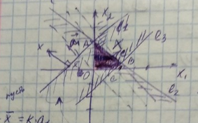
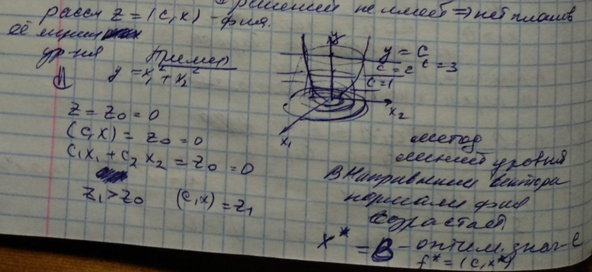

>  15.02.2019

*Опр:* Задача оптимизации - найти экстремум (min/max) некоторой критериальной (целевой) функции F(x), где $x \in X$ (допустимое множество)

**Задача безусловной оптимизации (минимизации)**

min f(x) (при этом X=$\mathbb{R^n}​$)

**Задача условной оптимизации (минимизации)**

min f(x) (при этом X - собственное подмножество $\mathbb{R^n}) [X \sub \mathbb{R^n}, X \neq \mathbb{R^n}]​$ 

**Задача классической оптимизации (минимизации на условный экстремум)**

$min\ \phi_0(x) , \phi_i(x)=0, i=\overline{1,m}, m<n, x \in R^n$

**Общая задача математического программирование**

$min f_0(x), f_i(x) \le 0, i=\overline{1,k}, f_i(x)=0, i=\overline{k+1,m}, x \in X_0 \sub \mathbb{R^n}$

**Задача линейного программирования** 

$min (c,x), (a_i,x) \le b_i, i=\overline{1,m_1}, (a_i,x)=b_i, i=\overline{m_1+1,m}, x \ge 0$

**Задача нелинейного программирования** 

Задача программирования, которая не является задачей линейного программирования (хотя бы одна функция не линейная)

**Задача вариационного исчисления**

$min[I(x)=\int_{t_0}^TL(t,x(t),\hat{x}(t))dt]$

$x(t_0)=x_0$

$x(T)=x_1$

**Задача оптимального управления**

$min[\Phi(x_0,x,u)=\int_{t_0}^Tf_0(t,x(t),u(t))dt+g_0(x_0,x(T))]$  

$\hat{x}=f(t,x(t),u(t)), x(t_0)=x_0, g_i(x,x(T)) \le 0$

u(t) - кусочно-непрерывная функция, $t \in [t_0,T]$  

**Задача теории приближения функции** 

$y=f(x), x \in [a,b],  p(x,a)=\sum_{i=1}^m\alpha_i\phi_i(x)$ 

Найти $p^*:||f-p^*||=inf||f-p(x,a)||$

**Задача планирования производства**

Имеем производство, которое заключается в переработке некоторых ингредиентов (ресурсов)

Дано:

m - виды ресурсов

$b_i$ - известный объем i ресурса

n - технологии, с помощью которых перерабатываются ресурсы.

Каждая технология определяется вектором), где $a_{ij}$ - норма затрат i при использовании j технологии с единичной интенсивностью.

Единичная интенсивность - за единицу может браться интенсивность каждого ресурса, либо по затраченным ресурсам, либо количеством продукции за единицу времени.

Затраты ресурса при использовании j технологии в единицу времени - будем ее использовать как интенсивность

$c_j$ - ценность, заключенная в конечном продукции, произведенной j технологии за единицу времени

Задача: требуется так спланировать производство, чтобы не выйти за рамки отпущенных ресурсов и суммарная ценность произведенной продукции была максимальна.

Пусть $x_j$ - искомая интенсивность j технологического способа. $X=(x_1,...,x_n)​$ - план производства.

$max\sum_{j=1}^n(c_j,x_j) $- максимальная суммарная ценность

$\sum_{j=1}^na_{ij}x_jb_i, i=\overline{1,m}$ - фактические затраты i ресурса

$x_j \ge 0, j=\overline{1,n}$ - условие неотрицательности, иначе j технология не используется

Второй вариант задачи планирования производства

m - виды ресурсов

$b_i$ - известный объем i ресурса

n - продуктов

), где $a_{ij}$ - норма затрат i при производстве одной единицы j продуктов.

Единичная интенсивность - за единицу может браться интенсивность каждого ресурса, либо по затраченным ресурсам, либо количеством продукции за единицу времени.

$c_j$ - ценность, заключенная в конечном продукции, произведенной j технологии за единицу времени

$x_j​$ искомое количество произведенного j продукта, чтобы суммарная прибыль была максимальна.

**Задача о диете [определение оптимального рациона].**

m - полезных веществ

$b_i$- норма потребления i вещества за планируемый период

n - продуктов питания

$a_{ij}$- содержание i вещества в единице веса j продукта

$c_j$ - цена единицы веса j продукта

$x_j$- количество купленного j продукта.

Количество потребления продуктов, чтобы человек, потребляющий их, обеспечил необходимую норму потребление веществ.

$min \sum_{j=1}^nc_jx_j, \sum_{j=1}^na_{ij}x_j \ge b_i, i=\overline{1,m}, x_j \ge 0, j=\overline{1,n}$

**Транспортная задача**

m - грузообразующих пунктов одного продукта

$a_i$ - объем производства в i пункте

n - потребителей

$b_j$ - потребность j покупателя

$c_{ij}$ - удельный транспортные затраты (стоимость перевозки единицы груза из i пункта производства в j пункт потребления)

Требуется так спланировать перевозки чтобы:

1. был полностью вывезен продукт из каждого пункта производства
2. полностью удовлетворены потребности потребителей
3. суммарные транспортные затраты на перевозки были минимальны

$x_{ij}​$ (перевозки) - количество продукции, перевезенные из i в j

Модель

$min\sum_{i=1}^m\sum_{j=1}^nc_{ij}x_{ij}, \sum_{j=1}^nx_{ij}=a_i, j=\overline{1,m}, \sum_{i=1}^mx_{ij}=b_i, i=\overline{1,n}, x_{ij} \ge 0,  j=\overline{1,m}, i=\overline{1,n}$

**Общая задача ЛП**

$min (max) \sum_{j=1}^nc_jx_j$, %20b_i), $x_j \ge 0, j=\overline{1,m} \le n$(может быть и m<n)

**Определения**

$\sum_{j=1}^nc_jx_j$ - целевая функция - функция, которая максимизируется или минимизируется

$(c_1,...,c_n)$ - вектор цели

Ограничения 3-х типов: неравенства(тут 2) и равенства

$A=(a_{ij})_{mn}​$%3D(A_1%2C...%2CA_n)) - матрица (условий) задачи

$(b_1,...,b_m)$ - вектор (правых частей) ограничений

$(x_1,...,x_n)$ - план задачи ЛП, если удовлетворяет всем условиям задачи.

Вектор допустим, если удовл-т всем ограничениям

Допустимая область задач X - совокупность всех планов задачи

Оптимальный план - план, если $\forall x \in X:(c,\bar{x}) \ge (c,x)$ для max, или $\forall x \in X:(c,\bar{x}) \le (c,x)$ для min[оптимизирующий целевую функцию $x^*=arg min\sum_{j=1}^nc_jx_j$]

$X^*$ - множество оптимальных планов решений задачи ЛП

$z^*=\sum_{j=1}^nc_jx_j$ - оптимальное значение задачи

Решить задачу ЛП, значит найти хотя бы один оптимальный план и посчитать для него значение целевой функции

> 22.03.2019

### Частные формы ЛП

1) Планирование пр-ва $\sum_{j=1}^nc_jx_j$

(2) $\sum_{j=1}^n a_{ij}x_j \le b_i, i=1,...,m$ <u>стандартная симметрия задача ЛП</u> 

$x_j \ge 0, j=1,...,n $

2) задача на min

(3)  канонич-я задача ЛП(равенства) $min\sum_{j=1}^nc_jx_j$; 

$\sum_{j=1}^na_{ij}x_j = b_i, i=1,...,m; x_j \ge 0; j=1,...,n$

(Решение методом Гаусса)

3) <u>Основная</u> задача (рассмотрим в теории)

$min \sum_{j=1}^nc_jx_j; \sum_{j=1}^na_{ij}x_j \le b_i; i=1,...,m$

(4) (подразумевается $x_j \ge 0$) (нет условий отрицания на переменную)

Сущ-т однозначные правила для перехода от одной задачи к другой, т.е. задачи эквивалентны.

Каждая форма имеет преимущество с т.з. ЛП

Симплекс метод - модификация метода Гаусса.

Для решения (3) в $L_p$, ее нужно привести к канонич. виду.

Можно упростить через матричный и векторный вид.

A = $(a_{ij})_{n \times n}; c = (c_1, ..., c_n) -вектор цели; b = (b_1, ..., b_n) - вект. правых частей; x = (x_1, ..., x_n)$

<u>Стандартная задача</u> вектор - столбец

(2') max $C^{T}$x; Ax $\le$ b; x $\ge$ 0 

Можно записать A = [$A_1, ..., A_n$]  = тут вертикально = $[a_1, ..., a_n]$

(2'') = max(c, x); $(a_i, x) \le b_i, i=1,...,m; x\ge0;$

(2''') max(c, x) $\sum_{j=1}^nA_jk_j \le b; x \ge 0$

<u>Правила перехода</u>

1) $max_{x \in S}f(x) = - min_{x \in S}(-f(x))$

$x^* - т. max$

$f(x^*) \ge f(x);\forall x \in S$

$-f(x^*) \le - f(x);\forall x \in S$

$min_{x \in S}f(x) = - max_{x \in S}(-f(x))$

2) $f_i(x) \ge 0 ~ -f_i(x) \le 0$

3) $(a_i, x) \le b_i$ ~ дополнительная переменная 

$x_{n+i} = b_i - (a_i, x) \ge 0$

~$(a_i, x) + x_{n+i} = b_i; x_{n+i} \ge 0;$

4) $(a_i, x) = b_i $ ~ $(a_i, x) \le b_i\ и\ -(a_i, x) \le - b_i$ - пара неравенств

5) Исключения переменных 

$a_{i_1}x_1 + a_{i_2}x_2 + ... + a_{in}x_n = b_i|: a_i; a_{i_1} \ge 0; x_i \ge 0$

$x_1 \frac{1}{a_{i_1}}(b_i - a_{i_2}x_2 - ... - a_{i_n}x_n)$

$x_1 \ge 0; a_{i_2}x_2 + ... + a_{i_n}x_n \le b_i$

### Метод Жордана-Гаусса

n переменных, m - ограничений

m перем-х через n-m перем-х

6) $x_j \ge 0$ ~ $-x_j \le 0$ ~ $(a_{ij}) \le b_j; b_j = 0; a_{ij} = -1$

7) $x_j$ - свободная перем-я

Правило: x = x'' - x'', x'$\ge$ 0, x'' > 0

$x_j = x_j' - x_j''$, где $x_j' \ge 0$ и $x_j'' \ge 0$

### Геометрическая интеграция задачи 

#### $l_p$  на пл-ти и графический метод решения

(5) $max(z=c_1x_1 + c_2x_2)$ при 

$a_{11}x_1 + a_{12}x_2 \le b_1​$

.

.

.

$a_{21}x_1 + a_{22}x_2 \le b_2$

$a_{m1}x_1 + a_{m2}x_2 \le b_m$

Построим X - допустимое множество 

$x - \bar{x} = k\cdot a_1​$

$(a_1, x) = (a, \bar{x}) + k(a_1, a_1) = a_{11}x_1 + a_{12}x_2 \le b_1$

= $b_1 + k||a_1||^2 > b_1$ (часть решения неравенства )

$l_1: a_{11}x_1 + a_{12}x_2 = b_1​$

$(a_1, x) = b_1; a_1 = (a_{11}, a_{12}) - вектор\ нормали$ 

$x_1 \ge 0; x_1 = 0 => 0x_2$

$x_2 \ge 0; x_2 = 0 => 0x_1$ 

X - общая часть всех полуплоскостей 

1) многоугольник (1 вариант из всех)

2) или неограниченное многоугольное мн-во

3) или пустое мн-во => решений не имеет => нет планов

$x^* = \{_{l_3}^{l_2}$

Ответ: $x^* = (x_1^*, x_2^*), f^* = +\infin$

Целевая ф-я неогранич сверху  на x

Реш-е задачи зависит от вектора $\vec{c}.$

Для нахождения нужно выбрать - $\vec{c}$

max($\vec{c}, x$) = -min(c, x);

$f^* = - \infin для min целевая функция не ограничена снизу​$

### Геометрические свойства задачи $l_p$ в $\mathbb{R^n}$

(6) <u>Основная</u> min(c, x); $(a_i, x) \le b_i; i=1,...,m$

X = {x|$(a_i, x_i \le b_i), i \in \overline{1, m}$}

Мн-во решений системы лин-х неравенств.

$x - x_1 = \alpha(x_2 - x_1); 0\le \alpha \le 1​$

$x = (1 - \alpha)x_1 + \alpha x_2 пробегает\ точки\ от\ x_1\ до\ x_2$

$x = \alpha_1 x_1 + \alpha_2 x_2$, где $\alpha_1 \ge 0, \alpha_2 \ge 0; \alpha_1 + \alpha_2 = 1$

x - выпуклая комбинация $x_1\ и\ x_2​$

_Опр:_ 

S - выпуклые, если вместе с любыми своими 2-мя точками

> 01.03.2019

$X: \{x|(a_i,x) \le b_i, i=1...m\}​$

X - множество решений, $X \in ℝ^n$.

Берем $\forall x \in [x^1,x^2], x^1,x^2 \in ℝ^n.​$

$Произвольная\ точка\ отрезка\ x_{\alpha}=(1-\alpha)x^1+\alpha x^2, 0 \le \alpha \le 1$

Опр. S - выпукло, если с любыми своими двумя точками оно содержит отрезок, их соединяющий (сюда же попадают пустые и одноэлементные множества).

$\forall\ x^1, x^2 \in S, \alpha \in [0, 1]: x_{\alpha} = (1-\alpha)x_1 + \alpha_2x_2\in S$

*Утв*. Пересечение выпуклых множеств выпукло.

$\forall x^1, x^2 \in S_i => x^1, x^2 \in (\forall\ i) =>  [x^1, x^2] \in S_i (\forall\ i) => [x^1, x^2] \in S​$

$Hi={x | (a_i,x)=b_i}, a \neq 0  - гиперплоскость ​$

*Утв*. Гиперплоскость есть выпуклое множество

$\forall\ x^1, x^2 \in H, \alpha \in [0,1] x_{\alpha} \in H(?)​$

$(\alpha, x_{\alpha}) = (1-\alpha)(a, x^1) + \alpha(a, x^2) =(1-\alpha)b + 2b$ #​

Гиперплоскость делит пространство на 2 полупространства

$H_i^-=\{x | (a_i,x) \le b_i\}​$

$H_i^+=\{x | (a_i,x) \ge b_i\}​$

Утв. $H_i^+,H_i^-$ есть выпуклые множества

$X= \cap _{i=1}^mH_i^-$ - многогранник решения системы (1)

*Свойство*: Множество X - выпукло

*Свойство*: Множество X - замкнуто

*Свойство*: Множество X - может быть ограниченным | неограниченным

*Опр*: Точка предельная, если $\overline{x} \in X {x_k} \in X, x_k \rightarrow \overline{x} (k \rightarrow \infin), x_k \neq \overline{x}​$

Предельная точка принадлежит множеству Х => мн-во X - замкнутое.

*Опр*. Точка называется внутренней, если $\forall e\ \exists\ O_e(x \in X)$

*Опр*. Точка называется граничной, если в любой окрестности могут быть как точки из X, так и точки не из X. Совокупность таких точек образует <u>границу множества.</u>

*Опр*. k-грань - множество ограничений-равенств размерностью k, т.е.4

(2)

$(a_{i_l},x)=b_{i_l} 	i_l \in 1...m, l=1...k, \{a_{i_l}\}​$ - линейно независимы

$(a_i,x) \le b_i; 	i \neq il​$

Ребра - 2 грани, остальные неравенства

Вершина - 3 равенства, остальные - неравенства

*Теорема*: X $\neq \empty.$Пусть r(A) = r. Тогда $\forall k=1...r​$ существует k-грань.

Максимальное r - ранг, а максимальный ранг - размерность пространства.

*Опр.* Вершина множества X - n-грань (пересечение линейно независимых гиперплоскостей)

(3)

$(a_{i_l},x)=b_{i_l} 	i_l \in 1...m, l=1...n, \{a_{i_l}\}$ - линейно независимы

$(a_i,x) \le b_i; 	i \neq il$

Точки k граней явл граничными точками

$\overline{x} \in X(i_k, ..., i_k) x = \overline{x}+\lambda a_{i_l}$

$(a_{i_l}, x) = (a_{i_l}, \overline{x}) + \lambda ||a_{i_l}||^2 = b_{i_l} + \lambda||a_{i_l}||^2 > b_{i_l}​$

*Опр.* Выпуклая комбинация точек $x^1...x^k\ есть\ x=\sum_{i=1}^k a_i x^i, a_i \ge 0, \sum_{i=1}^k a_i=1$

*Утв.* Выпуклое множество содержит все выпуклые комбинации своих точек

> Д-во: S - выпуклое мн-во, $x^1, ..., x^m \in S, x_{\alpha} = \sum_{i=1}^m\alpha_i x^i, \alpha_i \ge 0, \sum_{i=1}^m \alpha_i =1​$
>
> 1) k =2 $x_{\alpha} \in S$ - по опр выпукое мн-во
>
> 2) k =m - 1 предположение
>
> 3) $0 \le \alpha_m \le 1​$
>
> ​	$\alpha_m = 0$ вып для всех предыдущ 
>
> ​	$\alpha_m = 1 x = x_m. а x_m \in S$
>
> ​	$0 < \alpha_m < 1 => 0 < 1- \alpha_m = \sum_{i-1}^{m-1}\alpha_i​$
>
> ​	$x_{\alpha} = (1 - \alpha_m)\sum_{i=1}^{m-1} \frac{\alpha_i}{1-\alpha_m}x^i + \alpha_m x^m​$
>
> ​	$x_{\alpha} = (1 - \alpha_m)y + \alpha_m x^m \in S​$
>
> ​	$y = \sum_{i=1}^{m-1} \frac{\alpha_i}{1-\alpha_m} = \frac{1}{1-\alpha_m}\sum_{i=1}^m \alpha_i = 1$

*Опр*. Множество всех выпуклых комбинаций точек из M называется выпуклой оболочкой M (обозначается coM)

*Свойства*: 

1. coM - выпуклое мн-во

   > $x^1, x^2 \in coM$ 
   >
   > $x^1 = \sum_{i=1}^m\alpha_i x^i, \alpha_i \ge 0, \sum_{i=1}^m \alpha_i =1$
   >
   > $x^2 = \sum_{i=1}^m\beta_i x^i, \beta_i \ge 0, \sum_{i=1}^m \beta_i =1$

2. $M \sub coM​$

3. $S_i​$ - выпуклое мн-во, которое содержит M => 

   $coM \sub \cap_i S_i​$ и  $\cap_i S_i \sub coM ​$ => $\cap_i S_i = coM ​$ 

   

   $\alpha + (1-\alpha)\beta + (1-\alpha)(1-\beta) = (1-\alpha)(\beta + 1 - \beta) = 1-\alpha; \alpha + (1-\alpha) = 1​$

*Пример:* шестиугольник, разбиваем на треугольники. Точка x попадает в один из треугольников.

*Опр*. $\overline{x} \in M$ - крайняя (угловая) точка, если она не может быть представлена как нетривиальная выпуклая комбинация двух разных точек из M.

Нетривиальная, когда $\forall i\ \alpha_i > 0​$

*Теорема:* Любое выпуклое замкнутое ограниченное множество в $ℝ^n$ может быть представлено как выпуклая оболочка своих крайних точек.

> Д-во: $x^0 - вершина\ и\ x^0$ явл решением системы (3)
>
> r(A) = n 
>
> От противного: $x^0$ не явл крайней точкой Х. 
>
> $\exists x^1, x^2 \in X; x^1 \neq x^2; 0 \le \alpha \le 1;\ x^0 = \alpha x^1 + (1-\alpha)$
>
> $b_{i_l} = (a_{i_l}, x^0) = \alpha(a_{i_l}, x^1) + (1-\alpha)(a_{i_l}, x^2) \ge (a{1_l}, x^1) и \ge (a_{i_l},x^2) $
>
> $(1-\alpha)(a_{i_l}, x^1 - x^2) \le 0\ и\ \alpha(a_{i_l}, x^1, x^2) \ge 0 => (a_{i_l}, x^1 - x^2) = 0, i_l = 1 $

> 15.03.19.

$\bar{x}$ - кр.т. X

Показать, что она вершина

$\bar{x} $ не может быть внутренней точкой мн-ва X

$(a_{i_l}, \bar{x}) - b_{i_l}=0, l= 1, ..., L; (a_i, \bar{x}) - b_i \le 0, i \neq i_l$

$\{a_{i_l}\}$ - лин независ.

$\mathbb{I}$ = $\overline{1, m} = \{\mathbb{I_1} \cup \mathbb{I_2} \cup \mathbb{I_3}\}$,

$\mathbb{I_1}$ = $\{i_{l_1}, ... i_{l_L}\}$, $\mathbb{I_2} = \{i| (a_i, \bar{x}) = b_i\}$, $\mathbb{I_3} = \{i|(a_i), \bar{x} < b_i\}$

L = n , L < n

о\п

$(a_{i_l}, x) = 0$

l = $\overline{1, L} $

уравнений меньше чем неизвестных след система имеет ненул решение

=>$ \exists x^* \neq 0$

$x_1 = \bar{x} + \epsilon x^*$

$x_2 = \bar{x} - \epsilon x^*$

$\epsilon $> 0

$i_l \in \mathbb{I_1}$: $I(a_{i_l}, x_1) = (a_{i_l}, \bar{x}) + \epsilon(a_{i_l}, x^*) = b_i$

$i \in \mathbb{I_2}: I(a_i, x_1) = (a_i, \bar{x}) + \epsilon(a_{i_l}, x^*) = b_i + \epsilon(\sum\limits_{l=1}^L \beta_l a_{i_l}, x^*) = b_i$

$i \in \mathbb{I_3}: I(a_i, x_1) = (a_i, \bar{x}) + \epsilon(a_{i_l}, x^*) < b_i$

$x_1 \in X, x_2 \in X, x_1 \neq x_2$

$\bar{x} = 0.5x_1 + 0.5x_2$ (противоречие с тем что x - крайнаяя точка)

_Опр_: Выпуклая оболочка конечного числа точек - выпуклый многогранник

$x^1, .., x^m​$ 

многогранник ограниченное мн-во

x =$ \sum\limits_{i=1}^m \alpha_i x^i​$, 

$\alpha_i \ge 0,​$

  $ \sum\limits_{i=1}^m \alpha_i =1​$

Замкнутое мн-во - мн-во, содержащее все свои предельные точки

$\{x_k\} \in M\ \lim\limits_{n \rightarrow \infin} x_k = \bar{x}$ => $\bar{x} \in M$

$x_k = \sum\limits_{i=1}^m\alpha_i^k x^i,\ \alpha_i^k \ge 0(\forall \in \overline{1, m}, \forall k  \sum\limits_{i=1}^m \alpha_i^k =1)$

$\{\alpha_i^k\} \rightarrow \bar{\alpha_i}, i=1, m(k \rightarrow \infin)$

$0 \le \alpha_i^k \le 1$

m - огр=х числ-х посл-й

i = 1: {$k_j^1$}: $\alpha_1^{k^1_j} \rightarrow \bar{\alpha_1}$ $\sub$ {k} 

i = 2: {$k_j^2​$}: $\alpha_2^{k^2_j} \rightarrow \bar{\alpha_2}​$ $\sub​$ {$k_j^1​$} 

i = m: {$k_j^{m-1}​$}: $\alpha_m^{k^m_j} \rightarrow \bar{\alpha_m}​$ $\sub​$ {$k_j^m​$} 

$k_j^m$ - по всем $\alpha$ будут сходиться

$x_{k_j^m} \rightarrow \bar{x}​$

$x_{k_j^m} = \sum\limits_{i=1}^m \alpha_i^{k_j^m} x \rightarrow \sum\limits_{i=1}^m \bar{\alpha_i}x^i$ 

Получаем, что M - замкнутое мн-во

X = {x|Ax $\le b$} 

1) X - огр.

крайняя точка - вершина => вершин $\le C^n_m​$

2) X - неогр мн-во

ТУТ РИСУНОЧЕК

r(A) = n - ранг 

$p_1, .., p$ - вершины X

$s_1, ..s_q$ - непр тут дописать

### Разрешимость задач ЛП

Мн-во огр - теорема Вейерштрасса

Мнво не огр - решение м.б, а м.ю не быть

Чтобы задача на max была разрешима, достаточно, чтобы усл. ф-я была огр сверху на допуст мн-ве Х

Чтобы задача на min была разрешима, достаточно, чтобы усл. ф-я была огр снизу на допуст мн-ве Х

**Задача линейного программирования**

max(c, x)

(2) ($a_i, x$) - $b_1\le 0 $

x $\ge 0$ i = 1,...m

$x^*$ - решение (2): $f^* = (c, x^*) \ge (c, x) \forall x \in X$

Доказываем, что $x^*$ совпадает с одной из вершин

если предположим, что x - ограниченное множество, то оно будет многогранником и выпуклой оболочкой своих вершин

$p_1, .. p_N$ - вершины N

$x^* = \sum\limits_{i=1}^N\alpha_ip_i, \alpha_i \ge 0; \sum\limits_{i=1}^N \alpha_i = 1$

$\bar{p_i}: (c, \bar{p_1}) \ge (c, p_i), i =1,..,N$

$f^* = (c, x^*) = \sum\limits_{i=1}^N \alpha_i (c, p_i) \le  \sum\limits_{i=1}^N \alpha_i (c, \bar{p_i}) =   (c, \bar{p_i})\sum\limits_{i=1}^N \alpha_i$

$(c, x^*) \le (c, \bar{p_i})\ и\ (с, x^*) \ge (c, \bar{p_i})$ => $(c, x^*) = (c, \bar{p_i})$

$\bar{p_1}, ...\bar{p_k}$ - решение (1)

$\bar{p} = \sum\limits_{i=1}^k \alpha_i\bar{p_i}$

$(c, \bar{p}) = \sum\limits_{i=1}^k\alpha_i(c, \bar{p}) = \sum\limits_{i}^k \alpha_if^* =f^*$

ТУТ РИСУНОЧЕК 

проводим дополнительное ограничение

$x_1 + x_2 + .. + x_n = Q​$

$Q > x^*_1 + x^*_2 + .. + x^*_n$ - отсекает на каждой оси отрезок величиной Q

$X_Q$ - получается дополнительное множетсво

Рассматриваем

$X \cap X_Q$

$x^*$- решение и там и там, а теперь станет станет решением на ограниенном мн-ве

Значит, по предыдущ, решение задачи будет совпадать с вершиной этого множества

Причем оно не может совпадать с решениями, которые были в граничной гиперплоскости, т.е. точка будет лежать внутри пространства

**Опорные планы для канонической**

(3) min(c,x)

$(a_i, x) - b_i = 0, x\ge 0, i=\overline{1,m}$

 min(c, x)

$\sum\limits_{j=1}^nA_jx_j=b, x\ge 0$

$\bar{x} - план (3), \bar{x} = (\bar{x_1},\bar{x_n}), \bar{x_j} \ge 0$ 

$\{A_j\}_{j: x_j > 0}$ - лин. нез $\le$ m

_Утв:_ Любой опорный план задачи L явл. крайней точкой мн-ва Х

> Д-во: 
>
> $\bar{x} $ - опорный план 
>
> $\bar{x}$= $(\bar{x_1}, \bar{x_2},0,..., 0)​$
>
> о/п: $\bar{x} - не явл. кр. точкой X, тогда \bar{x}​$ - лежит на отр
>
> $\exists x^1, x^2 \in X, x^1 \neq x^2: \bar{x} = \alpha_1x^1 + \alpha_2 x^2$
>
> $\alpha_1 \alpha_2 > 0 $
>
> $\alpha_1 + \alpha_2 =1$
>
> Пусть $ x^1  = (x^1_1,...x_n^1​$) 
>
> ​	$ x^2  = (x^2_1,...x_n^2$) 
>
> Тогда $\bar{x} = (\alpha_1x_1^1 + \alpha_2x_1^2 + .. + \alpha_1x_n^1 + \alpha_2x_1^2)​$

